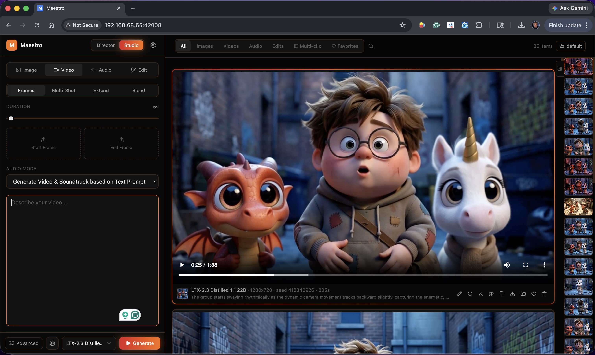

# Maestro

A one-click local AI **creative studio, director, and video editor** for creators. Maestro combines a modern interface with powerful image, video, and audio generation, an LLM-directed production workflow, and a non-destructive multi-track editor. Optimized for LTX-2.5, MiniMax H3, and the latest local creative models and LoRAs.



## What it does

- **Qwen Image 2.1 7B:** unified image generation and editing with up to ten
  references, dedicated prompt enhancement and transparent PNG output.
  Research/evaluation license; commercial use requires a separate Qwen license.
  [Usage and model details](docs/Qwen-Image-2.1.md).

### 🎬 Director Mode — automatic music videos and short films
The flagship feature. Drop in an audio track or write a story; a local LLM plans every shot, writes screenplays/lyrics, generates start frames & keyframes with character consistency, polishes prompts per model & LoRA-specific prompting guides, and runs the full multi-clip generation. Two skills:

- **Music Video** — beat-aware shot planning aligned to your audio. The LLM analyzes BPM, sections (verse/chorus/bridge), and energy, then writes shots that hit the downbeats. Speaker transcription & diarization lets you name and target different voices or singers. **Clip length** offers Auto or a model-aligned maximum, including shorter clips for smaller GPUs, while preserving the full song. [Director controls](docs/Director-controls.md).
- **Short Film** — screenplay-driven scenes with named characters, dialogue, and continuity across cuts. Pacing-bias slider controls cut frequency.
  
- **Auto Mode** runs the entire pipeline end-to-end (analyze → plan → generate images → generate clips → combine). Manual mode lets you review and edit at every step.
- **Director v2 architecture** separates screenplay writing, structured shot planning and model-specific formatting. Native H3 plans go directly through their H3 compiler; other paths use per-model polish where needed. Director shares Studio's adaptive writing and continuity guidance, with checks for source actions, exact dialogue and source-song vocals. Complex plans can still need review for continuity and completeness.

### ⚡ Performance Auto-Tune — zero-config setup
Detects your GPU, VRAM, and RAM on first launch and picks the right profile, quantization, VAE tiling, and VRAM safety coefficient. No more "Profile 1 vs 2 vs 4.5" guesswork. Power users still have full manual control under "Show advanced settings."

- **Recommendations stay current:** while Auto is enabled, revised recommendations apply once at startup. Manual mode and customized values are preserved. See [Performance Auto-Tune](docs/Performance-auto-tune.md) for memory profiles and controlled performance comparisons.
- **OOM recovery banner** auto-suggests lowering the VRAM headroom when a generation runs out, with one-click apply.
- **LM Studio memory:** explicitly unload a selected external writer instance from Settings → Integrations before image or video generation. Requires LM Studio 0.4 or newer; release is verified against its loaded-model list. [Memory controls and API](docs/LM-Studio-memory.md).
- **Live download status** during model setup ("Downloading transcription model (first use downloads ~300MB)..." instead of a vague spinner).
- **Cancel model downloads:** use **Cancel** beside an active download in **Settings → Performance → Enabled Models**, the model browser, or the download banner. Download actions are separate from the enable checkbox. **Cancelling** stays visible until the transfer stops; completed files stay installed and the download can be retried. Hugging Face may retain incomplete cache data for a resumable retry. [Download controls and API](docs/Download-controls.md).
- **Generation previews:** Settings → Performance → Generation Preview defaults to looping Live Video in Studio's generating card, with Fast Frames, Clearer Frames and Off also available. Saved choices are preserved. Previews add work and show approximate motion in the current window. Click the video to pause/resume playback. [Preview controls and API](docs/Generation-preview.md).

### 🎨 Studio Mode — full manual control
Direct access to every model and every knob:
- **Video** — create, extend, blend, retake, edit anything, outpaint, repaint, recast, upscale, and finish clips with MiniMax H3, LTX-2.5/2.3, SCAIL-2, Wan, Hunyuan, and many more.
- **LongCat Avatar:** open **Studio → Video → Avatar**, choose Single or Multi, and add an anchor image plus **Voice audio #1**. Multi also needs **Voice audio #2**; use the preview and percentage-based speaker boxes to match each voice to a person. Swap exchanges the two speaker boxes, and Reset restores left/right assignments. Required inputs are checked for both Generate and Add to Queue. Load Settings restores voices and boxes, including older LongCat Frames outputs. These original Avatar checkpoints use **50 sampling steps**, **Auto** sampler, and text/audio guidance of **4** by default; one-step diagnostic renders do not establish visual quality. LongCat uses windows of up to 93 frames (about 5.8 seconds for Avatar), with 13 frames of overlap, and continues across windows for the full requested audio duration. **LongCat Video** remains in **Frames** for text/image-to-video generation.
- **Image** — create, edit, upscale, or outpaint with Flux 2 Klein 9B, Krea 2 RAW/Turbo and Identity Edit, Qwen Image Edit, and more.
- **Audio** — generate music with MiniMax-Music3, ACE-Step or **YuE2**, speech and cloned voices with H3 Voice Audio, Kugelaudio or Qwen3 TTS, sound effects with H3 or MMAudio, and revoice existing clips.
- **YuE2 songs and personal styles:** 48 kHz stereo music with optional melody/chord planning, ABC scores and source-song covers. **My music (Experimental)** adds full-song transcription and voice-group review, resumable training, fixed auditions and portable styles. Choose AR song-style training or the author's tokenizer/decoder sound adaptation, with original/before/after listening comparisons. Check-only recordings help evaluate learning on another song. Training is optional; matching a specific singer's voice is not guaranteed. The exercised training GPU has 24 GB VRAM. YuE2 and the real-audio tokenizer weights have their own noncommercial model terms. [YuE2 music guide](docs/YuE2-music.md).
- **Multi-clip generation** with per-clip prompts, seamless overlapping (sliding window) transitions, and shared LoRAs
- **YuE2 Instrumental:** automatically applies a dedicated instrumental LoRA and melody/chord planning. The adapter downloads on first use; artist LoRAs pause while Instrumental is selected. [Instrumental guide](docs/YuE2-music.md#instrumental).
- **Long-form planning up to 60 minutes** with one-window, friendly duration, exact timecode, window-count, and Auto controls. Time holds the total runtime while Window holds the count and updates total duration as window length changes; unified H3 Enhance develops short concepts and preserves detailed scripts across windows.
- **Blend video Mode** Remember Sora 1 blend mode, where you could overlap two videos, and use AI to blend them together? 
- **Frames Injection (KFI)** for character continuity in long videos
- **Sliding window** for arbitrarily long generations
- **Viggle Animate:** select a saved character or image, describe its appearance, and let Flux 2 Klein prepare the replacement frame before three-step H3 animation. Preview the frame first or run both steps together; manual edited frames remain supported. See [Viggle Animate](docs/Viggle-Animate.md).
- **Studio composition workspace:** compact reference cards above a large prompt editor. Characters stays on the left; Recipes, Resolution, Aspect, Duration and Advanced group on the right. The model selector sits beside Generate / Add to Queue, with a direct Model Browser shortcut. The magic button runs Enhance now; its menu can instead arm **Enhance on generation** for the next job. Advanced groups Performance, Finishing, LoRAs and Generation. Time retains model-aligned steps through five minutes and presets through one hour; Auto shows its recommended duration. See [Studio controls](docs/Studio-controls.md).
- **Enhancement in the queue:** submit a brief while the GPU is busy and let Maestro enhance it when the job gets its turn, then generate automatically. Original inputs and completed drafts are saved for review and retries. Add to Queue keeps jobs held until Run queue; interrupted jobs are held after an app restart. Enhancement failures stop for attention instead of silently generating a fallback.
- **Detailed H3 source actions:** for eligible silent, locked scripts with long authored events, Maestro preserves the physical source phases and asks the writer for camera coverage and nonverbal sound. If individual camera cards still fail, it can recover those events while retaining the other cards. Recovered drafts identify the affected events and remain available for review or retry. Dialogue, creative staging, recurring actions and timed holds retain their existing planning paths.
- **Spatial upsampling, film grain, codec selection** as post-processing options
- **H3 VDN**, an optional trained hybrid-attention model with dedicated Full/Pruned and eight-step presets; requires Triton and additional VRAM.
- **TaoMate H3 three-step:** an optional Frames adapter preset with its own Euler/CFG settings and verified downloads. Existing fused and PDD recipes remain available. [TaoMate guide and tested scope](docs/TaoMate-H3.md).
- **H3 Voice Audio** for speech, one/two-reference voice cloning and general audio: up to 45 seconds per segment and five minutes per assembled output. See the [H3 audio guide](docs/H3-Voice-Audio.md). **H3 Outpaint** extends video borders; an optional six-step **H3 Audio Refinement** pass holds the generated video fixed.
- **Saved characters in every Speech workflow:** reuse Reference-mode character voices, save new characters from Speech, and restore character bindings with output settings. Qwen preset/design variants offer an explicit switch to voice cloning. See [TTS characters](docs/TTS-Characters.md).
- **Portable characters with voice:** share `blaine.maestro.safetensors` files with appearance and saved audio embedded. Model Browser → Characters / RefMods adds file and Hugging Face imports, voice filters, and easy export. Standard H3 RefMods retain their original visual latents. See [Character sharing and RefMods](docs/Maestro-Characters.md).
- **Better character images:** recover native-resolution PNG views from RefMods, choose a cover, and download selected images individually or as a ZIP. Original photos/video frames are used when available; selected PNGs and the cover travel with shared Maestro characters.
- **Characters in Image mode:** add saved characters and recovered RefMod views to models that accept image references. Choose specific views, keep source/reference order, and describe clothing or other appearance changes in the image prompt.
- **H3 Face Refiner:** automatically refine up to five tracked faces after generation, or use **Refine faces** on a gallery video. Preview face thumbnails, map saved characters and RefMods, or skip individual faces. Saves a new copy with the original resolution and soundtrack. See [H3 Face Refiner](docs/H3-Face-Refiner.md).
- **Media Flow** batches image/video finishing and video outpainting. RIFE 4.26 supports x2/x3/x4 frame rates. Optional **DLSS 5 Neural Rendering** and **DLSS Frame Generation** integrate with generation postprocessing and finishing tools on supported Windows 11/RTX systems. An opt-in **experimental Windows 10** backend adds 1x neural enhancement and 1.5x, 1.724x, 2x and 3x DLSS upscaling; Frame Generation still requires Windows 11. See the [DLSS installation guide](docs/DLSS5.md) and [port plan, validation and testing instructions](docs/development/wan2gp-12-71-port-plan.md).

### 🤖 Local LLM — built-in, no setup
Maestro auto-downloads `llama-server` (~600 MB one-time) and your chosen GGUF model on first use. Defaults to **Gemma 4 4B (Recommended)** — fast, capable, and runs comfortably on smaller GPUs. Auto-detects CUDA and binds the LLM to GPU when available.

- Pre-curated registry: Gemma 4 (2B / 4B / 26B MoE / 31B), Qwen3.6 27B, and **Qwen3.8 27B Uncensored** with model-aware deep thinking for creative writing and prompt enhancement
- **External providers** also supported: OpenAI, Anthropic, custom OpenAI-compatible endpoints (currently experimental)
- **Vision support** so LLMs can enhance prompting based on reference images
- Auto-unloads after 60s idle to free VRAM for video gen

### 🗂️ Browse the whole library

Choose **All folders** in the gallery folder picker to browse and search every output folder. Search includes original and enhanced prompts, and filters apply across the complete collection. Results load in pages and show their source folder. Browsing keeps your generation destination unchanged; identical filenames in different folders remain separate items. Media cards show timestamps; **Info** includes file details and upscale method, scale and before/after resolution when available. **Uploads → More → Delete upload** removes an unused source with confirmation. [Gallery controls](docs/Studio-controls.md#gallery-scope-and-search).

### 🛒 Built-in CivitAI model browser
- Search, filter, and one-click install any LoRA from CivitAI without leaving Maestro
- **LoRA update detection** — Check button refreshes from CivitAI, shows update badges on outdated LoRAs
- **My LoRAs view** with filters for Updates and direct uninstall
- **AI-generated LoRA prompting guides** Helps remove the guesswork from LoRAs. AI generates LoRA guides when LoRA is downloaded based on CIVITAI and HuggingFace repos. The guides explain what each LoRA does and how to use it, provide prompt examples, and recommend weight settings that are automatically applied when LoRA is selected. 
- **Recommended weight ranges** (sourced from CivitAI sidecars, HuggingFace, or fallback heuristics) shown directly on the weight sliders
- **Multi-LoRA pack auto-extraction** for archives that bundle several LoRAs
- **MiniMax H3 checkpoints:** import compatible community SafeTensor and GGUF transformers, including DaSiWa W4A8 INT4, from the Checkpoints tab. Includes format/layout preflight, SHA-256 verification, native workflow pairing and sampling defaults. Matching installed weights are reused. [H3 checkpoint import](docs/H3-checkpoint-import.md).

### 🎭 Themes
Three theme families, each with a dark and a light variant, switchable in Settings → System:
- **Golden Hour** (default) — warm cinematic palette with sunset-gradient CTAs and spotlight bezels; warm paper with burnt orange in daylight
- **Classic** — the original cool charcoal palette with blue accents; cool paper in daylight
- **Onyx** — minimalist monochrome, pure black with neutral grey surfaces; white and grey in daylight

Appearance mode is **Dark / Light / Auto** — Auto follows your system's appearance and switches live when it changes.

### ✂️ Editor Mode — finish the story on a timeline
- Arrange video, audio, and title layers on a non-destructive multi-track timeline with snapping, trim, split, duplicate, undo/redo, transitions, speed, opacity, volume, and canvas transforms.
- Browse outputs across workspaces, uploads, favorites, and complete Director productions; import Director shots as individual clips with their original soundtrack.
- Send a selected clip back through Maestro AI, then return the generated take to the same timeline position without rebuilding the edit.
- Export H.264, H.265, or AV1 at project or delivery resolutions with automatic hardware-encoder selection and export history.
- Responsive desktop and mobile layouts keep core editing controls usable from a phone or tablet.

### 📂 Workspaces
Multiple isolated output directories with a quick switcher in the sidebar. Useful for separating client projects, NSFW vs SFW, or experiments. Pinned and favorited outputs are tracked per workspace.

### 🔔 Completion alerts and private phone access
- In-app alerts, optional browser notifications, per-device chimes, and a host-computer completion sound are available under **Settings → Notifications**.
- Encrypted Web Push can notify an installed iPhone/iPad Home Screen app or supported desktop browser even after Maestro is closed.
- Optional **Tailscale Serve** support gives each user a private, trusted HTTPS address for Maestro using their own Tailscale account. It is restricted to that user's tailnet—Maestro never enables public Tailscale Funnel access and does not operate a cloud relay.

### 🔒 Mature mode + experimental gate
- **NSFW mode** is opt-in with a disclaimer step. Disabled by default. Gates uncensored model variants, NSFW LoRAs in the CivitAI browser, and the Settings → Services NSFW toggle.
- **Experimental features gate** hides power-user toggles (external API keys, Voice Reference, Inpaint, Restyle, Wan2GP Enhancer) by default for a focused first-launch experience.

### 📊 Director Pipeline Dashboard
View all past Director runs with their full state — clip plans, generated images, generated clips, polish diffs. Re-run any clip without re-running the whole pipeline.

## Updates

The version you are running is shown next to the Maestro title in the UI. To update, use the launcher's Update button in Pinokio.

### v2.6.0 (2026-10-04)

- **Live generation previews:** looping Tiny VAE video is enabled by default in Studio, with Fast Frames, Clearer Frames and Off also available. Includes pause/resume, phone playback, selected-model support labels and still previews for supported image models. Saved preview choices are preserved. H3 previews use the predicted clean result during denoising. [Preview guide](docs/Generation-preview.md).
- **Community H3 checkpoint imports:** compatible BF16/FP16, scaled FP8, INT8 ConvRot, W4A8 INT4 and GGUF checkpoints register native Frames and, when supported, References entries. Includes standard/Turbo/fused recipes, tensor-layout and SHA-256 verification, installed-weight reuse and Eros Max header-INT8 compatibility. [Import guide](docs/H3-checkpoint-import.md).
- **DaSiWa checkpoint support (#167):** download compatible checkpoints through the Model Browser instead of built-in DaSiWa selections. Verified H3 Hybrid v3 imports retain standard/baked-Turbo recipes and paired Frames/References workflows. [Model guide and family limits](docs/DaSiWa-models.md).
- **Singularity across video workflows:** experimental Frames and References entries support text, start/end/timed images, Control Video editing and ordered references, sharing the existing v1.3 checkpoint and recommended adapter. [Usage guide](docs/H3-Singularity.md).
- **LongCat Avatar:** a dedicated Avatar workflow below References, anchor/voice and two-speaker controls, corrected multi-speaker/audio-window routing, native window defaults and lower peak activation memory use.
- **Long source timelines:** Frames control videos/masks and H3 reference videos/soundtracks advance with each window. Auto duration follows timeline reference videos; character and voice samples remain reusable. [Studio controls](docs/Studio-controls.md#long-source-media-across-windows).
- **Object and sound-effect references:** preserve a prop's design without treating it as a character, or reuse a short effect sample in each window to guide matching generated sound.
- **Clearer duration planning:** Window keeps the selected count and updates total duration as Window Length changes, including experimental 30s H3 windows. Time keeps the total runtime; Auto follows the prompt or source. H3 guidance separates normalization speed estimates from GPU memory recommendations and marks the 14.4s recommended boundary.
- **H3 performance (#152):** native RMSNorm through 75,000 ordinary packed rows, bounded normalization for larger workloads, and explicit overrides. DaSiWa and compatible imported Turbo checkpoints support the configured dense backend and optional Sol Engine without adding another accelerator.
- **H3 prompt fidelity:** preserve eligible long locked action passages, repair failed camera cards with more precise feedback, bound semantic reviews, reduce camera-language/identity false positives, reject unclosed spoken quotes and preserve entrances in reference fallbacks.
- **Download cancellation and quieter status (#156):** separate enable/download actions, Cancel and Retry controls, safe cleanup, change-waiting status and hidden-tab suspension with compatibility fallback.
- **Gallery reliability:** thumbnail clicks stay with the intended asset while metadata loads, the thumbnail strip follows selection, action menus fit the viewport and video inputs display posters.
- **Runtime fixes:** explicit LM Studio model-memory controls, NVIDIA compute utilization, clearer Windows startup failures, correct failure status for skipped generation tasks and guarded INT8 kernel retries. MMGP is pinned to 3.8.2.

Use **Update** in Pinokio, restart Maestro and refresh the browser. See the
[complete release notes](docs/RELEASE_NOTES_V2.6.0.md) and
[validation scope](docs/VALIDATION_V2.6.0.md).

### v2.5.0 (2026-09-28)

**LoRA improvements, Qwen Image 2.1 tools, gallery playback and editing, and Windows 10 DLSS**

Includes the v2.4.1 and v2.4.2 updates below.

- **Readable LoRA names:** creator titles and editable display names across Studio, Director and My LoRAs, with version/variant labels and stable release/download dates. Original files and update tracking stay intact.
- **LoRA-aware enhancement:** active adapters' guides and trigger words reach the prompt writer, including H3 Frames and References. Downloads save available creator guidance automatically without loading an LLM.
- **Broader H3 LoRA support:** load compatible CivitAI adapters that use flattened module names, while retaining checks for incompatible or ambiguous weights.
- **Gallery slideshow:** automatically advance after each video, choose 1–10 seconds per image, and transition with the same upward swipe. Viewer controls fade during playback and return when tapped.
- **Sharper previews and easier uploads:** responsive video posters up to 1920 pixels, plus a fix for Frames image selections disappearing after the mobile photo picker closes.
- **H3 window timing:** preserve multi-window timing from Enhance through Generate (#160).
- **Use gallery audio:** send songs, soundtracks and voice samples directly to compatible inputs in the active sidebar, including Director, Studio references, Speech, Revoice and YuE2.
- **Trim before using:** choose an audio or video excerpt with a waveform or filmstrip, draggable handles, exact times and quick 3/5/10-second selections. Preview or zoom into the range, or use the full clip. Originals stay unchanged.
- **Krea Identity Edit:** Subject likeness, separate Scene likeness for two references, and Grounding resolution for RAW and Turbo. Settings persist per model and travel with queued jobs, presets and output settings.
- **Krea reference fixes:** preserve native reference proportions before grounding, fit reference latents without stretching, and hide Turbo's ineffective guidance control while keeping RAW guidance adjustable.
- **Qwen Image 2.1:** pose/depth/edge transfer, inpainting, LanPaint, outpainting, native **2K** presets, optional reference KV caching, and managed **Viggle Turbo** 4/5/6-step profiles. Updated prompt guidance, base settings and VAE tiling; fixed the inpainting-mode error on ordinary image generation.
- **H3 and LTX performance:** automatic H3 INT8 ConvRot video VAE selection with INT8 transformers, plus optional Comfy Kitchen kernels on supported RTX 50 hardware with compatibility fallbacks.
- **Windows 10 DLSS — Experimental:** optional 1x neural enhancement and 1.5x/1.724x/2x/3x upscaling for images and videos. Improved frame processing, audio preservation and worker cleanup. Requires a separate opt-in installation. DLSS Frame Generation is also available on supported Windows 10 systems after its separate installation and hardware/worker capability checks. [Setup guide](docs/DLSS5.md).
- **Gallery ordering:** keep results in chronological order during generation, refresh and pagination, while retaining the selected item (#155).
- **Media Info:** timestamps, measured resolution and file details, plus finishing method, scale, before/after resolution and frame rate, source and processing time when available.
- **Upload cleanup:** delete uploaded media from the gallery with confirmation and protection for inputs used by active jobs.

Use **Update** in Pinokio, restart Maestro and refresh the browser. Your existing projects, settings and media stay in place. Optional model assets download when first used; the Windows 10 DLSS backend requires explicit installation.

[Full v2.5.0 release notes](docs/RELEASE_NOTES_V2.5.0.md) · [Validation and remaining limits](docs/VALIDATION_V2.5.0.md) · [Changelog](CHANGELOG.md)

Included update details: [v2.4.2 release notes](docs/RELEASE_NOTES_V2.4.2.md) and [validation](docs/VALIDATION_V2.4.2.md); [v2.4.1 release notes](docs/RELEASE_NOTES_V2.4.1.md) and [validation](docs/VALIDATION_V2.4.1.md).

### v2.4.0 (2026-09-24)

**Immersive gallery, Qwen LoRA improvements, H3 Singularity, and better prompt-enhancement control**

- **Fullscreen gallery:** enlarge images and browse images/videos with vertical swipes, keyboard navigation and favorites. Tap to pause or play, keep your sound choice across clips, and pinch to zoom images. Prepared video transitions and cached first-frame posters improve mobile playback. Native fullscreen is used where the browser supports it.
- **Before/after image comparison:** move a divider between the source and result. The active sidecar image is selected by default, or compare other gallery/local images.
- **Gallery → active input:** send images, captured frames or whole videos to the visible Studio or Director inputs, including References, Frames, Animate, editing and upscaling.
- **Qwen Image 2.1 improvements:** a dedicated CivitAI LoRA filter, compatible fused-layer LoRA imports, and lower memory pressure when encoding multiple references. Enabled compatible Qwen models now appear in Director's image selector.
- **H3 Singularity — Experimental:** a separate v1.3 References model with the recommended LightX2V four-step Turbo preset, managed downloads, and Studio/Director support. [Testing guide](docs/H3-Singularity.md).
- **More reliable H3 enhancement:** more precise source-action, dialogue, reference and continuity checks; focused camera-plan repairs; and music-driven prompts that leave vocals to the supplied audio. Complex scenes can still require review.
- **Choose repair behavior:** Settings → Integrations lets you set **0–5 fidelity repair attempts** and optionally **Generate even if fidelity checks fail** for Enhance on generation. Default behavior remains one repair attempt and review when needed.
- **Director music fixes:** performance instructions apply to the visible cast, avoiding unwanted musicians in narrative shots. Dialogue markup, speaker/language ownership and supplied-audio handling are improved.
- **Reliability fixes:** Windows Face Refiner cleanup, Recast mask memory, API-key saving, remote LLM reference images, and bundled DramaBox guides.

Use **Update** in Pinokio, restart Maestro and refresh the browser. Existing projects, models, LoRAs and outputs stay in place. Singularity downloads its optional assets when first used.

[Full v2.4.0 release notes and issue coverage](docs/RELEASE_NOTES_V2.4.0.md) · [Validation and remaining limits](docs/VALIDATION_V2.4.0.md) · [Changelog](CHANGELOG.md)

### v2.3.0 (2026-09-20)

**Qwen Image 2.1, automatic music training, and a redesigned music LoRA library**

- **Qwen Image 2.1 7B:** generate and edit with the same model, combine up to ten references, use dedicated prompt enhancement, and save transparent PNGs. Includes memory offloading, tiled VAE processing and a separate selector for compatible LoRAs. [Image guide](docs/Qwen-Image-2.1.md).
- **My Music Auto training:** upload recordings, choose training targets and let Maestro prepare the dataset, train voice/sound, then train song style in one queued workflow. Defaults to 100 voice/sound steps and 200 song-style steps, with stop/resume and further training available.
- **Easier Guided training:** a clear recordings → voice/sound → song style → test-song workflow. Technical settings and alternate methods live in Expert settings. Matched tokenizer/decoder adaptation, checkpoint auditions and source-audio reconstruction help compare progress.
- **Automatic dataset preparation:** separate vocals, transcribe lyrics, detect voices and suggest clips from full songs. Guided mode lets you review speakers, words and boundaries; Auto uses suggested clips. Check-only songs stay out of training. New projects recommend v9 while existing projects keep their assets.
- **Music LoRAs in Advanced:** searchable checkboxes, individual strengths, automatic training triggers and an active-count badge. Choose which saved LoRAs appear in the selector, remove/restore library entries, import combined AI-Toolkit adapters, and experiment with multiple compatible LoRAs.
- **Better YuE2 instrumentals and songwriting:** Instrumental automatically uses the dedicated instrumental LoRA and composition recipe. Songwriting preserves the requested vocalist, vocal delivery and training trigger more clearly. [Music and training guide](docs/YuE2-music.md).
- **Experimental H3 clips up to 30 seconds:** opt in from Studio's Duration settings for Frames and References, including queued enhancement. Auto retains its normal GPU recommendations; Animate keeps its existing window length.
- **No replayed job notifications:** opening Maestro or reconnecting no longer shows completion/failure popups from old Studio and Director history. Jobs that finish while connected still notify normally.

My Music training, multi-LoRA mixing and extended H3 duration remain experimental. Vocal likeness and per-section voice switching are not guaranteed. Qwen Image 2.1 uses a research/evaluation license; commercial use needs a separate Qwen license.

Use **Update** in Pinokio, restart Maestro and refresh the browser. Existing models, recordings, projects, LoRAs and outputs stay in place. New models and optional tools download their assets when first used.

[Full v2.3.0 release notes](docs/RELEASE_NOTES_V2.3.0.md) · [Validation and limits](docs/VALIDATION_V2.3.0.md) · [Changelog](CHANGELOG.md)

### v2.2.4 (2026-09-18)

**Unified AI enhancement, YuE2 music, and more control over Director productions**

Includes the full v2.2.0 feature release and v2.2.1–v2.2.3 fixes below. **New in v2.2.4:** retry flagged H3 windows without rewriting the accepted prompts, and choose clearly whether to repair, edit or generate the complete saved draft.

- **Keep the windows that already passed:** if window 4 needs review in a six-window job, retry its camera plan while retaining the other five prompts, shared story, dialogue and continuity. Works in Frames and References with Enhance now or queued enhancement. Saved repair progress survives restarts.
- **Clearer prompt review:** **Generate all 6 windows with this draft** uses the complete saved draft. **Retry window 4 & generate** repairs the flagged window, then generates the full job if checks pass. **Edit prompts in Studio** opens the draft without starting generation. Full rewrites and generation from the original prompt are under **Other options**. Older drafts need a fresh enhancement to support targeted retries.
- **Silent product prompts:** fixes the reported logotype-timeline heading being counted as a speaking character. Duration and aspect qualifiers in silent-video briefs no longer hide the no-dialogue instruction.

- **More reliable H3 enhancement:** complete supplied conversations keep every line and its speaker; impossible dialogue durations receive a clear explanation before the LLM loads. Faithful camera paraphrases, colon-timed storyboards and silent reactions no longer trigger the same false review failures. Queued Enhance preserves reference names and actual voice bindings.
- **Lower H3 memory peaks:** bounded normalization addresses the allocation hotspot reported on an A100 40 GB in [#139](https://github.com/Blizaine/Maestro/issues/139), preserving reference detail and precision. The isolated operation is validated; a complete run on the reporter's hardware remains unverified.

- **One Enhance workflow:** develops short ideas and adapts detailed scripts to the selected model. Enhance now, or let a queued job enhance immediately before generation. An optional **Use by default** setting remembers Enhance on generation; saved source prompts and drafts remain available for review and retries.
- **Stronger H3 prompt writing:** improved silent-action parsing, dialogue ownership, choreography, camera direction, first-frame continuity and multi-window timing. Director shares the relevant writing guidance. Prompt review remains available for drafts that need attention.
- **YuE2 3B music:** the new default music model produces 48 kHz stereo songs, with Direct generation selected initially, optional composition planning, ABC scores and source-song covers. Later model choices are remembered.
- **My music (Experimental):** prepare full songs with automatic transcription, voice selection and reviewed clips, or supply recordings and lyrics yourself. Train and resume personal style adapters, compare checkpoint auditions, reconstruct source audio, and import/export styles. New projects recommend the matched v9 tokenizer and decoder. Style and vocal resemblance vary; this is not a promise of reliable singer cloning. [Preparation guide](docs/YuE2-music.md#prepare-full-songs-automatically).
- **Director music controls:** adjustable clip maximum and GPU limit, working Cut Speed, full-song timing, and musical/vocal cues for camera planning. Longer H3 clips can approach 14.4s; instrument cutaways retain the assigned singer's voice off screen. Shot edits now save reliably.
- **All folders gallery:** browse and search across output folders while keeping each item's source folder and the generation destination clear. Refresh, pagination and folder-qualified actions are fixed.
- **TaoMate H3:** optional experimental three-step Frames acceleration, with pinned downloads and compatibility checks. Includes internal token-refiner weights; it is not a separate video-refinement pass.
- **Image, queue and runtime fixes:** 21:9 image aspect, original/enhanced prompt details, multiline-image and Z-Image decoding fixes, corrected CivitAI model reloads, collapsible completed-job history, repeated-upload deduplication, and improved Linux local-LLM setup and diagnostics.

Use **Update** in Pinokio, restart Maestro and refresh the browser. Existing models, characters, outputs and projects stay in place. New models and optional music tools download their assets when used. YuE2 model/tokenizer weights have separate noncommercial terms; see the [music guide](docs/YuE2-music.md).

[Full release notes and issue status](docs/RELEASE_NOTES_V2.2.0.md) · [Validation and known limits](docs/VALIDATION_V2.2.0.md)

### v2.1.6 (2026-09-11)

**Better H3/Viggle memory use, detailed-prompt fixes, and simpler reference controls**

- **Faster streaming H3/Viggle jobs:** the per-job memory planner now passes its transformer allowance to MMGP so eligible profiles can retain more weights in VRAM.
- **Detailed action prompts stay out of the dialogue budget:** AI Faithful recognizes production headings, Role A/B descriptions and titled time ranges in imported briefs. Visual directions no longer trigger false “too much dialogue” errors for those formats, while actual spoken lines keep their timing checks.
- **Reference editing beside the thumbnails:** name and type fields expand beneath the selected reference row. Drag thumbnails to reorder them; saved character appearance and voice stay together. Preview, replacement and soundtrack controls remain available.
- **H3 Fused steps up to 12:** both Frames and References allow **4–12 total steps**, with four still the default. Studio remembers the last selected or used step count for each model across restarts, including when the browser port changes.

Use Pinokio's **Update**, restart Maestro and refresh the browser. Run Enhance again from the original prompt to apply the parsing fixes. Existing models and saved projects stay in place; these changes require no new dependencies or model downloads.

[Full release notes](docs/RELEASE_NOTES_V2.1.6.md) · [Validation and measured limits](docs/VALIDATION_V2.1.6.md)

### v2.1.5 (2026-09-10)

**Better H3 prompt adaptation, smarter Viggle INT8 execution, and audio and Director fixes**

- **More faithful detailed prompts:** pasted timed scripts keep their action phases, character profiles, camera directions and ending together. Production notes and silent action descriptions no longer inflate dialogue budgets. Complete action and sound descriptions survive the final H3 prompt compilation; the selected Maestro duration remains authoritative.
- **More reliable AI enhancement:** clearer camera-writing requests and larger response budgets reduce incomplete drafts. The LLM stays loaded throughout planning and repairs, fixing mid-enhancement `LLM not loaded` errors. Real Gemma 4 4B and Qwen3.8 27B checks preserved all eight phases of the regression example without repair or fallback; results remain editable.
- **Viggle / H3 INT8 performance:** corrected a fallback that promoted BF16/FP16 computation to FP32. ConvRot layers now compare the corrected fallback with Triton and retain the faster path when GPU memory allows. A local RTX 4090 layer test made the fallback about **3× faster**, while Triton still won and remained selected. This is a layer measurement, not a promised full-generation speedup.
- **Stereo audio stays stereo:** H3's 32 kHz stereo output survives video muxing and window joins, including mono prefixes and silent gaps. Shared audio resampling stays on CPU until encoding needs the GPU, avoiding unintended CUDA helper allocations.
- **Director seamless timelines:** validate each native H3 window against the saved shot limit, allowing the complete planned movie and its trimmed final window to render without being rejected as one oversized shot.
- **Safer performance updates and diagnostics:** revised Auto recommendations can refresh existing installs once while preserving custom settings and manual mode. Memory failures record RAM/VRAM readings before cleanup, and generic CUDA errors are no longer mislabeled as definite system-RAM exhaustion.

Use Pinokio's **Update**, restart Maestro and refresh the browser. Run **Enhance** again from the original prompt to replace a draft prepared by an older version. Existing models and saved projects stay in place; no new dependencies or model downloads are required.

[Full release notes](docs/RELEASE_NOTES_V2.1.5.md) · [Validation and measured limits](docs/VALIDATION_V2.1.5.md)

### v2.1.4 (2026-09-09)

**The v2.1 update: a larger Studio workspace, portable characters, new H3 tools and improved memory management**

This overview combines the features and fixes from **v2.1.0 through v2.1.4**.

#### Lower RAM use and faster H3 decoding — new in v2.1.4

- **Lower loading overhead:** H3 and Viggle read the video VAE's native checkpoint layout without repacking its weights into extra RAM. A local component-loading test removed about **4.35 GiB of private allocations**; existing FP16 and INT8 ConvRot checkpoints remain supported.
- **Faster video decoding:** following WanGP's H3 memory policy, cards with **10 GiB VRAM or more** keep the decoder on the GPU during decoding, then release it when another stage starts. Smaller cards retain streaming. A local FP16 decoder benchmark improved from **8.9s to 2.2s** with identical output; this measures decoding, not total generation speed. [Measurements and validation](docs/VALIDATION_V2.1.4.md).
- **Correct memory-profile limits:** profiles **3.5 and 4.5** now inherit their intended base budgets while preserving their pinning/transfer settings and explicit preload choices.

#### Studio: more room to create

- **One scrolling workspace:** media tabs, workflow selection, reference tiles and the prompt scroll together. Long prompts grow with their text; settings and **Generate / Add to Queue** stay pinned.
- **Compact controls:** Characters, Recipes, Resolution, Aspect, Duration and Advanced leave more room to write. Setting lists open above their buttons; the model selector sits beside Generate, with a direct Model Browser shortcut.
- **Clearer Advanced settings:** collapsible Performance, Finishing, LoRAs and Generation sections show active-count badges and hide empty sections. Director's H3 Video LoRAs regain editable weights, including restored settings.
- **Consistent mobile layout:** matching input tiles, a centered gallery header and viewport-bounded LoRA guides. All three theme families and their light/dark variants remain supported. [Studio controls](docs/Studio-controls.md).

#### Prompt enhancement and duration

- **Enhance before generating:** the magic button runs **AI Faithful**; its menu also offers **AI Creative**. Review and edit the result before submission. Both support image prompts; long H3 sequences expose editable **Exact H3 prompts** for each window.
- **Fuller Creative dialogue:** conversations, tutorials and character interactions use duration-aware targets of **2.8 words/second**, with up to **3** and six H3 speaker turns per window. Explicit talking points are checked against spoken lines; sparse windows get independent repairs that preserve successful work elsewhere. Faithful preserves supplied events and lines.
- **More accurate speech budgets:** action descriptions, production headings, quoted character names/styles and reference metadata stay out of dialogue counts. Quotations inside existing dialogue remain intact. Explicit silence and requests to use only supplied lines remain respected.
- **Clearer enhancement and audio handling:** fixed Omni's missing-`re` enhancement failure (#102). Music/style references retain their selected role even when descriptions mention voices; music-only requests reject unwanted speech. Malformed speaker assignments receive repair, named guests retain their own identities, and scenes can include more speakers than saved character references.
- **Visible planning feedback:** unresolved H3 warnings appear beside the normal prompt, including on mobile. Refresh preserves the selected AI Creative or Faithful mode. UTF-8 fixes keep Arabic, Cyrillic, Chinese, accented text and emoji readable in Director and enhancement (#96, #110).
- **Simpler Studio and Director duration controls:** Auto previews its recommendation in both Time and Window views. Moving the dimmed slider or choosing a preset switches to manual. Model-aligned Time steps reach **five minutes**, with **10m, 15m, 30m, 60m and Custom** presets for supported video workflows. Window sizing follows model/GPU limits or saved overrides; overlap is collapsed by default.
- **Consistent optional guidance:** single- and multi-window enhancement share the optional Mature-mode content guide only when that mode is enabled. A [14.4-second-window Reference tutorial example](docs/prompts/blaine-maestro-tutorial-script.md) includes native dialogue tags and presenter cues.

#### Director timelines and recoverable progress

- **Music videos keep the full song:** long H3 sections split into supported shots before review, and the structure preview shows the actual shot count. **Cut Speed** is available during assisted setup (#84, #117).
- **Reviewed images stay assigned:** subdivision retains each source scene's image. Completed start images and keyframes remain recorded if a later job fails or times out; Director image settings stay independent of Studio.
- **Legacy projects remain editable:** use **Open & Edit** to replan affected music projects. Updating preserves saved work; it does not reconstruct already shortened renders or repair corrupted saved text automatically.

#### Portable characters, RefMods and better reference images

- **Share complete characters:** export **`<character>.maestro.safetensors`** with appearance, saved voice, name/description and selected images. Import standard H3 RefMods separately from trained LoRAs; compatible upstream loaders can use the visual portion, while embedded voice is a Maestro extension.
- **Browse and reuse identities:** Model Browser adds **Characters / RefMods**, local and Hugging Face imports, voice filters, a saved **malcolmrey / MiniMax H3** collection and easy export. Multiple RefMods retain separate identities and voice bindings. H3 matches unambiguous filenames to natural character names and avoids treating pronouns as extra cast members.
- **Recover better images:** decode native-resolution PNG views, choose a cover and download individual images or a ZIP. Original photos/video frames are preferred when available; cached recovery preserves the original latent and audio. Selected views travel with exports and work in Image models that accept references.
- **Better character browsing:** scrollable mobile galleries, cached video thumbnails and cleaner display names make characters easier to identify. [Character sharing and recovery](docs/Maestro-Characters.md).

#### Viggle Animate and automatic character replacement

- **Three-step H3 animation:** supply a control video and an edited frame from **any point in the source video**. Longer videos use overlapping windows of approximately **5.2 seconds**.
- **Trim and select the frame in one preview:** set the source clip's start/end points and move a separate frame-selection playhead to choose the image to edit.
- **Automatic character preparation:** choose a saved character, recovered RefMod view or uploaded image. Flux 2 Klein replaces the subject in the selected frame, with editable appearance instructions. Preview first or queue preparation and animation together; Klein **9B and 4B** are supported.
- **Manual editing stays available:** send the frame to Image mode, edit it and use **Apply & return**. Saved settings retain frame time, character view and preparation choices. Appearance prompts control preparation; Viggle uses its fixed motion-transfer recipe. [Viggle Animate guide](docs/Viggle-Animate.md).

#### H3 Voice Audio and saved voices throughout Speech

- **Speech, voice cloning and sound:** H3 Voice Audio — Pruned produces **32 kHz stereo audio**, with up to **45 seconds per generation** and **five minutes per assembled output**. `Sound:` prompts support effects and ambience.
- **Longer conversations:** one or two voice references, named speaker turns, delivery cues and returning-speaker voice reuse work with boundary trimming. Duration is a ceiling; oversized scripts are checked before queueing, and cancelled jobs do not publish partial audio.
- **Saved characters across Speech:** reuse character voices, save new characters from Speech and restore names/reference bindings with output settings. Each model retains its speaker limits; Qwen preset/design variants offer a switch to voice cloning. [H3 Voice Audio](docs/H3-Voice-Audio.md) · [TTS characters](docs/TTS-Characters.md).

#### H3 generation and refinement

- **VDN Full/Pruned and eight-step presets:** an optional trained hybrid-attention path requiring **Triton and additional VRAM**, with its own compatible adapters. Performance depends on the hardware and workload.
- **LoRAs on Fused 4-Step:** compatible H3 character, style and concept LoRAs now work in Frames, References and Director while retaining the four-step recipe. Support remains experimental; acceleration/VDN adapters and unsupported DoRA are excluded. [Fused H3 LoRAs](docs/H3-Fused-LoRAs.md).
- **H3 Outpaint:** expand video borders with protected source content, preserved source audio, multi-window processing and batch support.
- **Audio Refinement Extra Phase:** optionally add **six audio-refinement steps** while locking the generated video latents. Fixed PDD/fused recipes and FL2VA source-soundtrack control are excluded.
- **Face Refiner:** detect, track and refine **up to five faces** automatically through **Advanced → Finishing**, or on an existing gallery video/upload. Map saved characters or RefMods, retain an identity or skip a face. A new copy preserves source resolution, frame count, FPS and soundtrack. [Face Refiner guide](docs/H3-Face-Refiner.md).

#### Media Flow, temporal upsampling and optional DLSS

- **Batch finishing:** Media Flow processes image/video collections through the shared queue with per-file progress, cancellation and saved settings while retaining source files.
- **Smoother video:** RIFE 4.26 adds **x3** alongside **x2/x4**, preserving duration and soundtrack. Optional DLSS Frame Generation offers **x2–x4** on supported RTX 40/50 systems, and **x5/x6** where supported on RTX 50.
- **DLSS 5 Neural Rendering:** use **x1** refinement or **x1.5–x3** enlargement with adjustable intensity and depth/motion controls. Native DLSS requires a **separate installation on compatible Windows 11/RTX hardware**; RIFE does not. Native DLSS quality/performance still need validation on supported hardware. [Requirements and installation](docs/DLSS5.md).

#### Fixes and polish

- Fixed the **H3 Extend model-switch crash / React error #185**, prompt resizing and scrollbar flicker, and unintended Director horizontal scrolling.
- Fixed mobile keyboard access to prompts, overlapping settings, off-screen LoRA guides and duration popups whose sliders jumped while dragging. The gallery stays in place behind the open sidecar.
- Improved the mobile Model Browser and added a manual **Destination LoRA folder** for URL imports, with an automatic best-match suggestion.
- Improved shared GPU offloading, cancellation and settings restoration; fixed locked ETA-history databases on Windows and expanded model, character, dialogue and UI regression coverage.
- **Better memory recovery:** failed-generation cleanup releases temporary inference tensors; manual model release also clears FlashVSR and other registered post-processors (#79).
- **Blackwell NVFP4 compatibility:** unsupported cuBLAS GEMM shapes use a dequantized fallback while compatible shapes keep acceleration (#105).
- **Linux local LLM repair:** llama-server installs required library aliases, searches its runtime directory and repairs incomplete cached runtimes on the next local LLM load (#85).
- Corrected initialization errors in Blend and video inpainting, added undefined-name checks, and corrected the bug-report log paths (#118). See [Finding logs](#finding-logs).

#### Updating

Use **Update** on Maestro's Pinokio page, restart Maestro and refresh the browser.
Existing models, outputs, workspaces, characters, presets and Director/Editor
projects stay in place. Update installs the Face Refiner detector dependency;
new model assets download when needed, and DLSS uses its separate installer.

Run enhancement again on affected prompts to apply the dialogue and audio fixes.
The memory update uses existing checkpoints and requires no model conversion.

See the [v2.1.4 release notes](docs/RELEASE_NOTES_V2.1.4.md) and
[validation record](docs/VALIDATION_V2.1.4.md). Detailed release history remains
available for [v2.1.0](docs/RELEASE_NOTES_V2.1.0.md),
[v2.1.1](docs/RELEASE_NOTES_V2.1.1.md), [v2.1.2](docs/RELEASE_NOTES_V2.1.2.md)
and [v2.1.3](docs/RELEASE_NOTES_V2.1.3.md).

### v2.0.1 (2026-09-04)

**Stability and exact workflow restoration**
- Fixed GitHub issue #97, where an LTX Auto-duration feedback loop could flash the interface and leave a black screen after updating to v2.0.0.
- Fixed Video Extend window math so one requested continuation window cannot become a full pass plus a tiny second pass. The duration UI, prompt count, and runtime now agree on how much new footage the source-overlap pass contributes.
- Fixed **Extend this video** on gallery clips so it opens Studio Extend and places the selected clip in the source drop zone, including on mobile.
- Fixed H3 AI Faithful dialogue inflation caused by an instructional `<d>` marker being interpreted as the start of a giant spoken line. Auto-expanded jobs now plan from the user's original prompt instead of reparsing an already enhanced Context-IR prompt.
- Rebuilt **Load Settings** as a complete round trip across Studio generation, transform, audio, finishing, Mixer, Director, and Editor workflows—including source media, references, masks, anchors, LoRAs, H3 optimizations, and workflow-specific controls.
- Added single-window generation time to expanded gallery details and a dedicated Copy button for Original Prompt.
- Expanded sidecar fidelity and portable release validation so older outputs restore safely and incompatible settings from the previously viewed output cannot leak into the next run.

See the [complete v2.0.1 release notes](docs/RELEASE_NOTES_V2.0.1.md).

### v2.0.0 (2026-09-03)

**A complete create-to-edit workflow**
- Added the new full-screen **Editor Mode** with multi-track video, audio, and title editing; 21:9 canvases; canvas transforms and snap guides; transitions, speed, opacity, volume, fonts, undo/redo, project history, and hardware-aware export.
- Director productions can be opened as editable timelines with separate shot clips and the complete soundtrack, while any timeline clip can make a round trip through Maestro AI and return as a new take.
- Reorganized Studio into clear Video, Image, and Audio workflows. Video editing tools now live beside generation, Image adds dedicated New/Edit/Upscale/Outpaint modes, Audio includes Revoice, and Finish adds reusable film grain.
- Added unified long-form planning up to 60 minutes with duration presets, exact timecodes, direct window counts, media/story-aware Auto duration, and Faithful or Creative AI window prompts. Frequently used Studio modes, models, planning choices, and H3 optimizations now survive restarts.

**MiniMax H3, references, and local intelligence**
- Added H3's native 768p tier, 21:9 canvases, and Regenerate 2K workflow, plus Alibaba PAI FL2VA and Ref2VA acceleration presets with native PDD support.
- Added optional experimental **H3 Fused 4-Step** Frames and References models. Both share one pinned INT8 ConvRot checkpoint, default to the published four-evaluation recipe, expose 4-8 Total Steps, and use SLA sparse attention with a safe dense fallback.
- Added a reusable Omni character library for named image + voice or video references, automatic reference-duration budgeting, and stronger reference isolation so identity media is not mistaken for a start frame. Exact Subject/Speaker bindings keep each character's face, voice, and dialogue together and reject phantom subjects.
- Rebuilt H3 prompt planning around causal story continuity, exact dialogue preservation, official Context-IR guidance, model-aware token fitting, and safer multi-window continuation. Faithful Studio planning now keeps the user's event/dialogue schedule authoritative while the LLM concentrates on cinematography.
- Added Qwen3.8 27B Uncensored with creative thinking controls, prompt-enhancement telemetry, and non-thinking structured-output paths.

**Remote workflow and release polish**
- Added completion alerts, optional chimes, encrypted closed-app Web Push, an installable Maestro web app, and optional private HTTPS access through each user's own Tailscale account. Windows restores opted-in Tailscale access after Maestro restarts without repeated approval prompts.
- Added per-clip, multi-window, and full Director completion estimates, including cache-aware calibration for First Block Cache and private local timing history for more accurate future estimates.
- Expanded gallery details and search across model, resolution, LoRAs, H3 optimizations, prompts, window counts, and generation timing, while making the viewed or playing clip the reliable active Studio target.
- Updated Maestro's orange app icon, unified the responsive Director / Studio / Editor header and version display, added Director first-frame thumbnails and full-rate iOS Editor preview playback, simplified the Pinokio menu, and preserved the v1.9.1 llama.cpp nightly-download hotfix.

See the [complete v2.0 release notes](docs/RELEASE_NOTES_V2.0.md) and [Tailscale setup guide](docs/TAILSCALE_REMOTE_ACCESS.md).

### v1.9.1 (2026-08-25)

**Local LLM hotfix**
- Fixed prompt enhancement failing with an HTTP 404 on fresh Windows installations after llama.cpp changed its latest-release packaging.
- Maestro now follows llama.cpp's official nightly-build pointer, verifies the required Windows CUDA archives before downloading, and safely falls back to a known-good binary build.
- Existing cached llama-server installations continue to be reused without another download.

### v1.9.0 (2026-08-19)

**Universal queue and Director recovery**
- Added one global Studio + Director queue with a compact top-bar popover, live count badge, ordering controls, removal, pause, and start controls.
- Studio's split Generate button can now hold complete jobs without starting them, so several prompts can be prepared before the GPU begins working.
- Director projects are checkpointed before rendering and can be restored through Load Settings with their models, references, prompts, plans, and generation options intact.
- Added a persistent Director render queue that survives restarts, owns copies of its input assets, and runs complete projects sequentially without colliding with Studio work.
- Improved cancellation and GPU coordination across held, queued, running, and resumed jobs.
- Removed queued jobs from the main gallery so unfinished work no longer appears as large blank generation cards.

**Director, dialogue, and Music3 reliability**
- Added live progress while Director generates a MiniMax-Music3 soundtrack instead of leaving the interface apparently idle.
- Improved MiniMax-Music3 speed and memory use with an optimized Qwen semantic engine, reusable KV caches, accelerated RVQ decoding, and safe GPU fallbacks.
- Reworked Music3 prompting around its official bare section tags and duration-aware song structure, preventing stage directions from being sung and reducing truncated songs.
- Added automatic UTF-8 repair throughout Director planning and saved projects while preserving valid international text.
- Improved MiniMax H3 prompt enhancement so requested dialogue languages and attached-frame visual details are retained.
- Fixed duplicate or malformed nested H3 dialogue fields causing valid Director projects to fail canonical prompt validation.

**Model, LLM, and GPU compatibility**
- CivitAI checkpoint imports now map only to verified compatible Maestro architectures, validate tensor layouts before publishing, and hide unsafe legacy registrations without deleting their weights.
- Remote OpenAI-compatible LLM providers now support their own API key, standards-compliant request payloads, multimodal prompts, model selection, and useful endpoint error details.
- Fixed llama.cpp binaries and CUDA support archives being downloaded repeatedly; valid local runtimes are now detected and reused.
- Prevented harmless Gemma 4 template compatibility notices from being presented as the cause of a Director crash, and continuously drain local LLM logs to avoid long-run pipe stalls.
- SCAIL-2 now honors Maestro's shared attention backend and safely falls back when an installed FlashAttention wheel lacks kernels for the active GPU.

**Studio and interface improvements**
- Moved LoRA selection near the top of Advanced settings and fixed LoRA update tracking when several variants exist on the same CivitAI release.
- The main prompt editor now grows with its content, browser spellcheck is enabled, and prompt enhancement remains attached to the editor.
- Made the gallery filter bar responsive with compact labels, horizontal navigation, and an accessible search overlay on narrow screens.
- Simplified the Studio footer with an icon-only Advanced control and separate Generate / Add to Queue actions.
- Cleaned up fresh-install model defaults so unavailable and mature-only models are not selected or exposed incorrectly.
- Stopped disconnected media requests promptly, eliminating repeated `socket.send()` console noise after a browser closes or changes pages.

### v1.8.7.1 (2026-08-17)

**MiniMax Music3 GPU compatibility**
- Fixed MiniMax Music3 crashing on Windows GPUs when FlashAttention imported successfully but its wheel did not contain a CUDA kernel for that GPU architecture.
- Music3 now validates the bundled FlashAttention wheel against the active GPU before selecting it and automatically falls back to SDPA when necessary.
- Update removes the incompatible architecture-specific FlashAttention package from affected legacy Windows runtimes while preserving acceleration on supported GPUs.

### v1.8.7 (2026-08-16)

**MiniMax H3 audio, continuation, and shared models**
- Music / Performance timeline audio in H3 Omni is now preserved as the exact target soundtrack and advances through long multi-window sequences instead of behaving like a reusable style reference.
- Selecting a performance timeline automatically adopts the audio duration and enables multi-window generation when necessary, while Voice and Style references keep their existing behavior.
- H3 Video Extend now keeps the complete source clip and uses its audiovisual tail for native same-shot continuation instead of creating an unrelated replacement clip.
- Added consistent WanGP INT8 ConvRot and BF16 selection for all Pruned and Full First / Last and Omni variants, including linked-model readiness and storage accounting.
- H3 startup diagnostics now identify where every component was loaded from and report whether the transformer is INT8 ConvRot, BF16, or legacy scaled FP8.

**LTX music-video timing**
- LTX-2.5 Director vocal performances are planned as native independent shots, with the correct source-song segment and lip-sync instructions applied to every generated window.
- When available, Audio Analysis' separated vocal stem improves mouth-motion conditioning while the untouched original song remains in the final video.
- Dashboard regeneration follows the same LTX-2.5 soundtrack and vocal-conditioning path as the initial Director run.
- Fixed LTX-2.3 losing its audio-driven mode after model changes or restored settings even though the soundtrack remained selected.

### v1.8.6 (2026-08-15)

**Director music-video reliability**
- Long MiniMax H3 Omni Director projects no longer stop merely because the full batch has run for two hours. The timeout now measures stalled progress, allowing large shot counts and long soundtracks to keep generating while work is advancing.
- Improved LTX-2.5 music-video lip sync by explicitly locking visible vocal performances to each exact source-soundtrack segment.
- Applied the LTX-2.5 sync contract to standard, Seamless, and Dashboard-regenerated clips while leaving the proven LTX-2.3 workflow unchanged.

### v1.8.5.1 (2026-08-15)

**Linux performance runtime**
- Fixed the H3 high-performance runtime upgrade repeatedly restarting on Linux Mint and Ubuntu when the system CUDA toolkit did not match Maestro's PyTorch CUDA 13 runtime.
- Linux now uses pinned, prebuilt CUDA 13 SageAttention and FlashAttention wheels instead of compiling them against the host CUDA toolkit.
- Optional attention-wheel failures no longer block installation: Maestro can continue with Sol/SDPA fallback while required runtime validation prevents incomplete environments from being marked ready.

### v1.8.5 (2026-08-14)

**MiniMax-Music3**
- Added native local MiniMax-Music3 generation for complete stereo songs from structured music direction and lyrics, with selectable 5-second to 5-minute runtimes and a two-minute default.
- Added a duration-aware AI song writer that scales lyrics, sections, arrangement, transitions, and instrumental space to the selected track length instead of forcing every idea into a full-length song.
- Added MiniMax-Music3 as a soundtrack generator in Director Music Video mode, alongside ACE-Step.
- Added staged single-GPU memory management, verified component downloads, interrupted-install detection, and model-specific Studio controls and guidance.

**Director workflow flexibility**
- Reorganized Director setup so aspect ratio, resolution, workflow, and video/image models appear before media uploads and remain visible after audio analysis. Music and image upload areas now keep a consistent, easy-to-find size throughout setup. Setup choices lock once prompt planning begins, and changing the video model safely rebuilds clip timing without re-uploading the source.
- Added **None — no generated images** to Director's image-model selector. Auto mode can now plan and render directly from video prompts without loading an image model.
- Manual Director projects can optionally upload a different scene image for any shot while leaving other shots prompt-only.
- Disabling generated shot images does not disable user references: an uploaded main start image still anchors Seamless LTX and H3 First / Last runs, while H3 Omni continues to receive the supplied character, location, image, and voice references for its clips.
- Added native Seamless Director support for MiniMax H3 First / Last, carrying motion and synchronized audio between windows while assigning each native pass only its correct local prompt.
- MiniMax H3 Omni music videos now condition against the exact source-song segment for each shot and retain the pristine continuous soundtrack, rather than merely treating the song as a style reference.
- Director now displays the model-adapted H3 clip count and native durations after planning, so long screenplay sections no longer appear as unsupported 20-second H3 generations.
- Added Director-owned Turbo, Sol Engine, and First Block Cache controls to the persistent Advanced menu for MiniMax H3 models, including Turbo checkpoint selection and cache tuning.
- Simplified MiniMax H3 and LTX-2.5 Director setup by hiding inapplicable image/audio strength sliders and locking both conditioning strengths to their supported 1.0 values.

**LTX long-form generation**
- Restored automatic LTX window sizing: increasing total duration now grows each native pass to the model ceiling before adding more windows, unless the user explicitly locks a shorter window.
- Reworked AI-planned LTX sequences so every native pass receives a complete standalone prompt with the persistent camera, speed, style, identity, location, lighting, audio, and continuity rules it needs.
- Improved seamless one-take and open-ended prompts so later windows do not reset, invent cuts, slow down, or resolve action the user asked to continue indefinitely.
- Fixed LTX-2.5 continuation failing after the first window or corrupting audio history when generated audio returned in sample-major layout.

**Reference and generation reliability**
- Fixed LTX-2.5 generation with multiple reference images plus reference audio failing when a BF16 attention mask met an FP32 query tensor.
- Fixed MiniMax H3 Music Video planning failing on an unbalanced dialogue tag when a repetitive source-song transcription exhausted the LLM output limit. Source vocals now remain mapped driving audio instead of being copied into scripted dialogue.
- Component-based models now verify all required assets before being marked installed, preventing partial MiniMax-Music3 downloads from appearing ready.
- Expanded regression coverage for MiniMax-Music3, Director image policies, H3 Seamless generation, LTX sequence planning, continuation audio, and mixed-dtype reference attention.

### v1.8.1 (2026-08-13)

**MiniMax H3 model sharing**
- Maestro can now reuse WanGP's compatible pruned FL2VA and Ref2VA INT8 ConvRot checkpoints instead of downloading separate scaled-FP8 copies.
- Shared Qwen3-VL text/vision encoders are detected across both folder layouts, while non-identical VAE files remain separate for safety.
- Added checkpoint-layout detection and component-source diagnostics so shared H3 installations load the correct tensor format and clearly report which app supplied each asset.

**Account-free installation**
- Maestro no longer opens a Hugging Face sign-in flow during Install. Installation and default managed-model downloads require no Maestro or Hugging Face account.
- Added an explicit **Connect Hugging Face (Optional)** launcher action for custom gated models or higher download limits.
- Fixed the missing LTX-2.5 component message incorrectly claiming that its managed repository was gated.

### v1.8.0 (2026-08-13)

**LTX-2.5 and next-generation LTX workflows**
- Added native local LTX-2.5 with synchronized audio. Distilled is enabled by default, while Dev and NVFP4 variants can be enabled in Settings.
- Added the official Distilled 8-step base pass, learned latent upscaling, and 3-step full-resolution refinement, with persistent model reuse for faster follow-up generations.
- Added first and last frames, timed frame injection, audio-driven video, control-video audio, native audio, and compatible LTX-2/2.3 LoRAs from the existing shared library.
- Added LTX-2.5 to compatible Director Music Video, Short Film, and seamless-generation workflows.
- Fixed LTX-2.5 LoRAs producing noise on INT8 ConvRot checkpoints and added a choice between the fast video decoder and optional NAD diffusion decoder.

**LTX multi-window sequences**
- Added one consistent Multi-window Sequence workflow to all LTX video models, with AI-planned or exact one-prompt-per-window manual modes.
- Added duration and window counts, early prompt validation, editable generated window prompts, and chronological prompt planning that advances the story instead of repeating it.
- Improved LTX-2.5 continuation so full motion and matching audio history cross each window boundary cleanly without distorted seams or a slowdown in camera movement.

**Audio, saved settings, and performance runtime**
- Fixed slowed-down generated audio across MiniMax H3 and LTX and repaired standalone soundtrack routing when loading older settings.
- Load Settings now restores LTX window choices and geometry plus H3 Turbo, Sol Engine, First Block Cache, text encoder, and their associated values.
- Made the tested Sol-capable Python 3.11 / PyTorch 2.10 / CUDA 13 environment the normal Install, Update, and Start runtime on compatible RTX 40- and 50-series systems, while retaining safe fallbacks.
- Reordered the Studio sidecar to Duration, inputs or Omni references, H3 Optimizations, then Multi-window Sequence.

### v1.7.5 (2026-08-11)

**MiniMax H3 Performance Update**
- Added the experimental H3 Sol Engine sparse-attention backend for supported RTX 40- and 50-series GPUs, with cached kernel compilation and an automatic safe fallback.
- Added one collapsible H3 Optimizations panel for Turbo, Sol Engine, and First Block Cache; each can be enabled independently or combined.
- Updated the managed Turbo default to the newer v4-600 EMA LoRA at six steps and strength 1.0, while retaining the previous preset for rollback and comparison.
- Added pinned checksums, atomic downloads, local receipts, and a scheduled upstream-change monitor for managed H3 Turbo releases.
- Added the same Turbo preset, Sol Engine, and First Block Cache controls to Director. Settings now survive project saves, Dashboard regeneration, repair, and resume.
- Hardened RTX 50's CUDA 13/Triton runtime and made interrupted optional RTX 40 Sol installations repairable through Update without replacing the normal runtime.

### v1.7.2 (2026-08-11)

**MiniMax H3 sequence and compatibility fixes**
- Fixed legacy Director projects and uploaded audio/video producing ordinary frame counts that H3 rejected as outside its native frame lattice.
- H3 now repairs those clip schedules without accumulating timeline drift, and saved Director projects mark affected clips for safe Dashboard regeneration.
- Fixed manual First / Last multi-window generation applying the complete multiline prompt to every window; each line now drives exactly one window, with prompt-count validation before model loading.
- Fixed H3 GGUF image and video reference conditioning failing on mixed FP16/FP32 vision-encoder weights, without changing the established NVFP4/AWQ path.
- Expanded regression coverage for saved-project timing repair, media-derived clip lengths, manual window routing, and GGUF visual references.

### v1.7.1 (2026-08-10)

**MiniMax H3 memory stability**
- Fixed long 540p H3 generations becoming slower and exhausting VRAM while the same 720p workload succeeded.
- Rebalanced transformer residency and activation workspace smoothly across clip lengths and resolutions to avoid Windows shared-GPU-memory paging and excessive Copy activity.
- Added safer full-duration projection chunking for Full and Pruned checkpoints, validated in both First / Last and Omni workflows.

### v1.7.0 (2026-08-10)

**MiniMax H3 native multi-window generation**
- Added native multi-window continuation to both First / Last and Omni, carrying recent motion and synchronized stereo audio into each following window for smoother transitions.
- Added shared Multi-window controls with total duration, editable per-window prompts, optional AI planning, and independent hard-cut sequences.
- Improved H3 sequence planning so actions, dialogue, camera cuts, sound, and story events advance across windows instead of repeating or finishing in the first clip.
- Added exact-duration assembly, model-aware overlap handling, and saved runtime prompts so long generations can be reviewed, edited, and reproduced.

**New H3 media workflows**
- Added multiple timed frame injection for First / Last generations.
- Added audio-driven video from an uploaded soundtrack or a control video's audio.
- Added video-to-audio generation that preserves the source pictures while creating a new synchronized soundtrack.
- Added H3 video-to-video editing for the whole frame, inside a mask, or outside a mask, with adjustable denoise and mask strength.
- Fixed Omni music and performance references restarting from the beginning in every sequence clip; each window now receives the correct timeline segment while voice references remain reusable.

**Memory, performance, and RTX 50 support**
- Added VRAM-, model-, and resolution-aware H3 window recommendations with a native 14.4-second ceiling and saveable user overrides for proven hardware combinations.
- Improved transformer residency, activation workspace, streaming VAE decoding, RAM budgeting, and LoRA fallback behavior for Full and Pruned H3 models.
- Added a dedicated RTX 50 / Blackwell runtime with Python 3.11, PyTorch 2.10, CUDA 13, compatible acceleration kernels, automatic migration, startup diagnostics, and one-click repair.
- Preserved the established runtime for RTX 20/30/40 systems while applying hardware-specific setup only where required.

**Workflow and interface reliability**
- Added early validation for incompatible H3 media, prompt counts, durations, and sequence settings before expensive model loading begins.
- Fixed Omni reference uploads on iPhone and iPad so supported audio files are selectable even when iOS reports unusual file types.
- Generation cards now show active generation time in minutes and seconds, excluding time spent waiting in the queue or loading models.
- Expanded regression coverage for H3 continuation, reference packing, audio timing, frame injection, video editing, memory recommendations, RTX 50 setup, and the shared multi-window interface.

### v1.6.5 (2026-08-08)

**MiniMax H3 performance and lower-VRAM support**
- H3 Turbo now works with the recommended Pruned 20B models as well as the optional Full 33B models.
- Turbo now starts at six steps and LoRA strength 0.50, while keeping the LoRA visible and adjustable in Advanced settings.
- Reworked H3 model residency, activation chunking, and VRAM budgeting to reduce step-zero out-of-memory failures and excessive CPU offloading.
- Added resolution- and GPU-aware First / Last window recommendations, with clear warnings and a manual override for experimental combinations.
- Added an optional experimental First Block Cache for faster H3 generations, with selectable quality/speed thresholds.

**H3 resolutions and long-video planning**
- Added a faster model-aligned 720p tier using 1280x704 landscape output and matching portrait, square, and 4:3 canvases.
- Restored 1080p H3 generation with an experimental note and hardware-aware shorter-window recommendations.
- Hid the less efficient 768p preset from the main selector while retaining compatibility with existing saved settings and API requests.
- Added automatic H3 sliding-window storyboarding: one idea is expanded into a complete, editable prompt for every continuation window.
- Actions, dialogue, camera coverage, sound effects, ambience, and music are distributed across the timeline instead of being completed and repeated in the first window.
- Each exact window prompt is visible during generation in its own full-height editor, with the active window highlighted and no nested scrollbars.

**Director H3 workflow improvements**
- Director now uses the same H3 resolution, VRAM, and native-frame rules as Studio when planning shot lengths and execution profiles.
- Long scenes are divided before generation to fit the selected model, resolution, GPU, and Turbo configuration instead of being silently shortened at runtime.
- Added H3 Turbo controls and adjustable per-LoRA strengths directly to Director mode.
- Improved independent-shot context so recurring characters, wardrobe, locations, blocking, dialogue, and sound remain self-contained across prompt-only H3 shots.

**MiniMax LoRA discovery and compatibility**
- Added a MiniMax H3 filter to the CivitAI browser and routed downloaded H3 LoRAs into the correct shared H3 folder.
- Pasted Hugging Face MiniMax H3 LoRA URLs now use the same correct destination instead of defaulting to LTX.
- Added automatic H3 LoRA architecture conversion where required so compatible adapters can run on both Pruned and Full checkpoints.
- Added early validation, pinned support assets, and clearer recommendations for combinations that may exceed available VRAM.

### v1.6.1 (2026-08-06)

**MiniMax H3 Turbo mode**
- Added the H3 Turbo LoRA to the Full H3 model lists as a managed, first-use download.
- Added an experimental one-click Turbo mode for Full First & Last and Full Omni models.
- Turbo mode uses six inference steps and starts at LoRA strength 0.70.
- The active Turbo LoRA is shown in Advanced settings so its strength can be tuned per generation.
- User-adjusted Turbo strengths are preserved while duplicate Turbo adapters and incompatible Pruned-model combinations remain blocked.

### v1.6.0 (2026-08-06)

**MiniMax H3 Omni Reference**
- Added MiniMax H3 Omni for generating new video and synchronized audio from ordered image, video, voice, motion, and sound references.
- References can be reordered, labeled with their intended role, and used for identity, appearance, scene, motion, voice, performance, ambience, or music conditioning.
- Added both recommended Pruned 20B and optional Full 33B Omni models.
- Added Match Output reference preparation for consumer GPUs and an optional Maximum Detail mode for higher-memory systems.
- Improved reference-video memory use with output-aware sizing, chunked projections, dedicated attention workspace, and safer model re-profiling.

**Expanded H3 models and performance options**
- Simplified the model choices to First & Last and Omni, with clear Pruned 20B and Full 33B variants and concise explanations in the selector.
- Added Full 33B support for both workflows, including ConvRot checkpoint loading, fused projection handling, and memory-efficient streaming.
- Added selectable NVFP4-AWQ, GGUF Q2/Q4, Quanto INT8, and BF16 Qwen3-VL text encoders with hardware-aware recommendations.
- Added support for the MiniMax H3 Turbo LoRA on compatible Full 33B models with true 4, 6, and 8-evaluation schedules.
- Incompatible Turbo LoRA and Pruned-model combinations are rejected before loading instead of failing after a long generation.

**H3 Studio workflow and prompting**
- Omni generations are limited to the native 345-frame maximum: 14.375 seconds at 24 FPS, displayed as 14.4 seconds, with sliding-window controls automatically hidden.
- First & Last uses the same native 14.4-second maximum per window and can now generate longer videos by continuing each window from the preceding final frame.
- Long First & Last runs preserve the requested duration, remove continuation overlap, keep synchronized audio aligned, and apply an optional end image only to the final window.
- Fixed portrait and other selected aspect ratios being forced or decoded as 16:9.
- Improved H3 Prompt Enhance for exact dialogue retention, stable speaker IDs, voice-reference intent, opening ambience, silent intervals, and reduced gibberish or invented speech.

**MiniMax H3 in Director**
- Added model-aware Director workflows for both First & Last and Omni models.
- First & Last can create prompt-only shots or use optional generated start/end frames, while Omni can condition shots on character, location, voice, video, soundtrack, and other project references.
- Director no longer spends time writing or generating unused start images for H3 prompt-only workflows.
- H3 shot prompts now carry the project world, location, wardrobe, character blocking, screen position, dialogue, soundscape, and continuity needed by independently generated clips.
- Added stable project-wide speaker mapping, locked screenplay dialogue, duration-aware pacing, and multi-speaker exchanges with camera changes inside a single H3 clip.
- Incomplete or altered local-LLM shot plans are repaired deterministically without silently truncating, moving, duplicating, or rewriting approved dialogue.
- Dashboard repair and regeneration recreate the same H3 references and timing, including exact per-shot audio conditioning and one clean final soundtrack.

**Compatibility and reliability**
- Director model lists now show only image and video models that support the selected automated workflow.
- Native audio generation is distinguished from audio-reference input so incompatible models are no longer offered for audio-driven jobs.
- Reduced console noise by hiding successful system-stat polling while retaining failures and meaningful API requests.
- Interrupted saved Director jobs are now reported as interrupted instead of disappearing as missing projects.
- Expanded automated coverage for H3 checkpoints, quantization, Omni reference packing, Turbo LoRA, Studio continuation, Director compatibility, dialogue planning, memory behavior, and UI contracts.

### v1.5.5 (2026-08-04)

**MiniMax H3 local audio-video generation**
- Added native local MiniMax H3 Base FL2VA support with text-to-video, image-to-video, and first/last-frame video generation.
- H3 generates synchronized 32 kHz stereo audio together with the video instead of requiring a separate audio pass.
- Added approximately 5-15 second generation at 24 FPS with landscape, portrait, square, native 768p, and lower-VRAM resolution options.
- Added automatic, revision-pinned provisioning for the compact scaled-FP8 transformer, NVFP4 Qwen3-VL conditioner, video VAE, audio VAE, tokenizer, and processor assets.
- The initial integration focuses on H3 Base FL2VA; H3 Ref2VA reference-video/audio conditioning and hosted 2K regeneration are not yet included.

**H3 prompting and dialogue**
- Added an H3-specific Context-IR Prompt Enhance workflow using the model's native multimodal description, soundscape, music, speaker-ID, and dialogue-tag structure.
- Vague requests such as two characters discussing a subject can now be expanded into concise, meaningful dialogue sized to the selected duration.
- User-supplied dialogue is preserved verbatim, and remaining time is assigned to silent visible action to reduce invented speech and gibberish.
- Start-frame prompts now receive the correct H3 image-alignment instruction while raw prompting remains available by simply not using Prompt Enhance.
- H3 enhancement bypasses the incompatible generic cinematic enhancer and remains one native timeline instead of being divided into false sliding-window paragraphs.

**H3 compatibility, memory, and reliability**
- Corrected compact Qwen3-VL prompt conditioning so H3 follows the requested subject instead of producing unrelated repeated scenes.
- Added native row-scaled INT8 embedding support and corrected NVFP4 pre-quantization and combined-scale handling for Comfy-format checkpoints.
- Fixed mixed-dtype model profiling, keyframe CPU/CUDA device mismatches, and first-frame generation failures.
- Added activation chunking, explicit transformer working-memory reservation, and MMGP-friendly dtype locks so H3 can stream on consumer GPUs without starving the first denoising step.
- Added regression coverage for prompt conditioning, quantized checkpoint loading, keyframes, scheduler behavior, audio output, activation chunking, and H3 prompt structure.

**Multi-character Recast continuity**
- Improved SCAIL-2 Recast when a mapped character enters later within an otherwise continuous camera shot.
- Added hidden identity pre-roll conditioning so late-arriving characters can be introduced without publishing an artificial visible cut.
- Recast assembly now validates that all generated segments are present and that the final output retains the exact source timeline length.

### v1.5.0 (2026-08-02)

**SCAIL-2 Recast and multi-character replacement**
- Rebuilt Recast around SCAIL-2's native replacement conditioning for substantially stronger identity transfer and motion tracking.
- Added color-mapped character cards for replacing up to five people in one run.
- Added camera-shot detection and per-shot processing so characters remain correctly mapped when a video cuts between close-ups, wide shots, and group shots.
- Improved two-person and multi-person shots by conditioning each shot only on the characters visible in it.
- Added automatic reacquisition when a person first appears later, leaves the frame, or returns after a camera cut.
- Other people in the scene are now preserved automatically when bystanders are detected.
- References are automatically isolated from their backgrounds, aligned to the target, and supplemented with a face-detail view when useful.
- Added optional lighting and shadow matching using Z.ai's official SCAIL-2 Relighting LoRA, downloaded, verified, and converted automatically on first use.
- Added 480p, 512p, and 704p quality profiles with VRAM-aware window sizing; model steps remain independently adjustable.
- Fixed reference-image backgrounds, white bars, halos, false gray scenes, blurry identity starts, and reference stills appearing at the beginning of output videos.
- Fixed mismatched reference and control-video aspect ratios causing tensor errors or allowing the character image to control the output canvas.

**SCAIL-2 Repaint**
- Added Repaint as a first-class Edit mode for changing characters, objects, or the visual treatment of a video while retaining its motion and camera path.
- Repaint detects camera cuts, processes each shot independently, and rejoins the exact source timeline with one continuous audio track.
- Added multi-region and multi-character mapping with stable colors across shots.
- Repaint now shares Recast's 480p, 512p, and 704p resolution profiles and adaptive VRAM windows.
- Wired inference steps and applicable guidance controls to the generation pipeline while hiding advanced settings SCAIL-2 does not use.
- Simplified the Repaint and Recast interfaces, moved detailed guidance into tooltips, and ordered Edit modes as Retake, Edit Anything, Outpaint, Repaint, and Recast.

**LTX-2.3 Outpaint and Retake**
- Rebuilt Outpaint around LTX-2.3's official In/Outpainting IC-LoRA workflow with mask-preserving source conditioning.
- Added shot-aware Outpaint: multi-scene videos are split at camera cuts, processed independently, and reassembled at the exact original frame count with the source audio restored.
- Improved seams, detail, color-temperature matching, and removal of green/yellow marker spill without grading the protected source region.
- Source pixels remain protected while the full source frame stays available as visual context for newly generated areas.
- Output canvas dimensions now follow the selected quality preset and display the actual aligned pixel size before generation.
- Fixed Outpaint ignoring visible inference-step settings, using invalid schedules, or failing immediately on supported LTX models.
- Fixed Retake failing on LTX-2.3 distilled and two-stage pipelines.

**Krea 2 image generation and editing**
- Added Krea 2 RAW Identity Edit and Krea 2 Turbo Identity Edit using the current Krea 2 vision-conditioning pipeline and Identity Edit v1.2 LoRA.
- Added identity-preserving instruction edits, inpainting, outpainting, background removal, and support for up to two total reference images.
- Added automatic Qwen3-VL vision-encoder provisioning and accurate installed/readiness checks.
- Added compatibility with current Diffusers, Kohya, and GGUF Krea 2 weight formats.
- Added a dedicated Krea 2 filter to the CivitAI browser and My LoRAs view, with downloads routed to the correct Krea 2 library.
- Krea 2 RAW, Turbo, RAW Identity Edit, and Turbo Identity Edit are now enabled by default in Image mode for new and existing installations.

**Studio, models, and control video**
- Enabled-model choices now persist server-side across Maestro restarts and changing Pinokio ports.
- Newly downloaded CivitAI checkpoints appear in model selectors immediately without restarting Maestro.
- Control video and audio behavior are now independent in Frames mode: keep source audio, generate audio from the prompt, or use an uploaded soundtrack.
- Missing Temporal Depth assets for LTX control-video workflows are downloaded with progress, resume support, hash verification, and atomic installation.
- Voice Reference is now a standard feature, enabled by default and no longer hidden behind the in-development feature switch.
- Cleaned up Recast and Repaint Advanced Settings so only controls used by the selected SCAIL-2 pipeline are shown.

**Reliability and fixes**
- Director no longer creates a duplicate combined file when a run contains only one finished clip.
- Fixed SCAIL-2 relighting and user LoRAs failing validation when stale multi-phase weights were present.
- Fixed installed Maestro apps being hidden or blocked by an early Pinokio NVIDIA detection failure.
- Added broad regression coverage for SCAIL-2, Repaint, Outpaint, Retake, model visibility, temporal-depth downloads, and Krea 2 editing.

### v1.4 (2026-07-20)

**Storage and space optimization**
- Added a full Storage Manager with usage analytics and cleanup recommendations.
- Added safe deletion for workspaces, saved Director projects, models, and LoRAs.
- Added duplicate model and LoRA detection across linked installations.
- Added safe duplicate reclamation while preserving a verified copy.
- Added optional removal from linked installations through the Windows Recycle Bin.
- Improved storage accounting for shared weights, linked folders, junctions, symlinks, and hardlinks.

**LoRA management**
- Added LoRA file sizes, release dates, download dates, and compact age indicators.
- Added sorting by name, newest download, newest release, or file size.
- Added newest-first sorting to the Studio and Director LoRA selectors.
- Improved explanations for shared-weight, linked-only, and otherwise protected files.
- Added CivitAI response caching for faster browsing and fewer rate-limit problems.

**Director Dashboard and repair**
- Added a durable Check + Repair workflow for saved Director projects.
- Repair can regenerate missing images and videos, skip valid clips, and automatically rejoin the result.
- Repair continues when the browser is refreshed or closed.
- Interrupted repairs can be resumed without repeating completed clips.
- Fixed repair stopping after generating only one image or video.
- Fixed missing thumbnails, incorrect missing-clip counts, and incomplete clip tracking.
- Regenerating a start image now correctly marks its existing video for regeneration.
- Rejoin now rejects missing, invalid, or stale clips instead of creating an incomplete video.
- Dashboard operations now remain responsive while regeneration or repair runs in the background.

**Director character consistency**
- Director now generates an establishing character image when no reference image is supplied.
- The generated image becomes the shared reference for all subsequent start images.
- Character references and profiles are incorporated into the generated anchor.
- Generated start images are now correctly supplied to their corresponding video clips.
- The generated reference is retained for later Dashboard regeneration.

**Music-video timing and lip sync**
- Fixed Dashboard-regenerated clips becoming shorter than their original timeline slots.
- Regenerated clips now use the same FPS and frame schedule as a complete Director run.
- Fixed cumulative lip-sync drift after replacing one or more clips.
- Fixed rejoined videos using the wrong starting point in the source song.
- Rejoined videos continue to use one clean, continuous soundtrack without audible clip-boundary blips.
- Dashboard audio conditioning now matches the exact timeline segment assigned to each clip.

**Job cancellation and reliability**
- Significantly improved Stop and Cancel behavior across Director and Studio.
- Queued and actively generating child jobs are now canceled together.
- Late completion or failure can no longer overwrite a canceled job.
- Improved timeout handling and cleanup of partial outputs.
- Made Director state saving atomic to prevent damaged project files.
- Prevented delete, resume, repair, and regeneration operations from conflicting with one another.

**Downloads and model installation**
- Added clearer model and LoRA download progress, completion, failure, and retry states.
- Fixed inaccurate download percentages.
- Prevented concurrent downloads from writing to the same destination.
- Incomplete or corrupted downloads are no longer published as installed models.
- Hardened CivitAI archive extraction against unsafe paths and invalid files.
- Improved cleanup of failed and interrupted downloads.

**Safety, compatibility, and stability**
- Improved Director's minor-content safety checks.
- Improved detection across deeply nested planning data while reducing common false positives.
- Fixed sidebar crashes when changing models or generation modes.
- Improved NVIDIA GPU compatibility checks during Pinokio installation.
- Expanded automated regression testing for both dev and main.

### v1.3.3 (2026-07-17)

**Fixed**
- **Recast no longer crashes when the person leaves the scene.** If the target walked out of frame partway through the clip (or only appeared later in the video), the tracking step died with a cryptic "No points are provided" error and took the whole job with it. Tracking now locks on wherever the person first appears, works in both directions from there, and if it loses them mid-video it keeps everything tracked so far and picks them back up when they return. Frames where the person genuinely is not present simply keep the original footage, which is what replace mode should do. Both underlying bugs exist in upstream WanGP too; a keyword that matches nothing in the video now shows the friendly "could not find" message instead of a traceback.

### v1.3.2 (2026-07-17)

**New**
- **Models can be downloaded ahead of time.** In Settings -> System -> Enabled Models, the download icon next to each model is now a real button: click it and Maestro fetches everything that model needs (weights, text encoder, add-on modules, bundled LoRAs) in the background, with progress in the download banner. The row flips to a check mark when it finishes. Generating still auto-downloads on first use as before; this just lets you get the wait out of the way on your schedule.

**Fixed**
- **Recast no longer crashes on a fresh install.** The automatic masking step runs before the SCAIL-2 model loads, but its detector checkpoint only downloaded together with the model, so the very first Recast on a clean install failed with "SAM3.1 checkpoint was not found". The masking step now downloads the detector itself on first use.
- **The downloaded check marks tell the truth now.** Models that borrow their weights from a base model (SCAIL-2 14B Fast, the Z-Image ControlNets) always showed as not downloaded, even when they were ready to run. The check now follows those references and also requires add-on modules and bundled accelerator LoRAs, so a check mark means the model generates without downloading anything.
- Deleting a model now removes only the files that belong to it, so deleting a finetune leaves shared base weights in place for the models that still use them.
- SCAIL-2's image reference no longer fails when the detection phrase finds nothing in your character image; Maestro automatically falls back to broader phrases ("person", "woman", "man").

### v1.3.1 (2026-07-17)

**Fixed**
- **Model downloads no longer fail when your saved Hugging Face token has gone stale.** A stale or expired token made Hugging Face reject even public files with a misleading "Repository Not Found" (reported as the SCAIL-2 download failing, issue #20). Maestro now detects the rejection and retries the download anonymously, which covers everything Maestro ships. Valid tokens are still used first, so gated models keep working.
- Recast's Advanced Settings no longer show resolution and window controls that the generation ignores (Recast runs at SCAIL-2's native 480p with its 81-frame windows).

### v1.3.0 (2026-07-17)

**New: SCAIL-2 character animation.** Z.ai's follow-up to SCAIL Preview, integrated end to end. It transfers a performance from any video onto any character with no skeleton extraction, and it comes in two flavors: **SCAIL-2 14B** (the full native 40-step model) and **SCAIL-2 14B Fast** (bundled lightx2v distill, 6 steps, and no CFG for rapid animation). Fast is the recommended starting point for Recast, though results can vary by seed. Both are enabled by default. About 16.6 GB downloads on first use, plus a small detector model.

- **Animate (Video tab).** Pick SCAIL-2 in Frames mode, drop a character image as the Start Image and a performance clip on the new Control Video tile, generate. The character performs the clip's motion in their own scene. Output follows the source clip's frame rate (capped at 30fps) and keeps its audio.
- **Recast (Edit tab).** The headline: replace a person in an existing video with your character. Drop a video, type who to replace ("woman", "man in red"), preview the selection with the eye button, drop the character image, generate. Masking is fully automatic (SAM3 keyword tracking), and the scene, camera, and audio are preserved. The prompt is optional; describing the new character helps identity.
- **Use current frame as reference.** Gallery videos now have the same left-arrow button images have: scrub the preview to the moment you want and click to send that exact frame to the Reference tiles, which is the perfect way to pick a character out of an existing clip for Recast.

**Fixed**
- Sliding-window, frame-rate, and audio defaults now reach generations reliably (previously a 10s SCAIL-2 run could go out as one giant window and overflow VRAM, render at 16fps instead of the source rate, or come back silent).
- SCAIL-2's VRAM budget now accounts for its in-context conditioning (it carries the driving video as extra tokens), so 480p multi-window runs fit a 24 GB card with room to spare instead of spilling into system memory.
- "10 seconds" now means 10 seconds of your source clip regardless of its frame rate, and 60fps sources no longer double the generation work.
- Queued Recasts wait their turn for the GPU instead of running their detection passes on top of the active generation.

### v1.2.8 (2026-07-16)

**Fixed**
- **Linked LoRAs now show up in My LoRAs.** The library view only listed Maestro's own loras folder, even though guide generation and the Studio selectors already saw LoRAs from Linked Model Folders. My LoRAs now lists them too — with their names, previews, and generated guides — and marks them with a "Linked" badge so you can tell which library each one comes from.

### v1.2.7 (2026-07-16)

**Fixed**
- **LTX generation crash ("TypeError: not a string") on Linked Model Folder installs** — the follow-up to v1.2.6's text-encoder fix. That fix created Maestro's own Gemma folder to hold the downloaded weight, but the folder then hid the linked install's complete folder that has the tokenizer files, and the tokenizer loader crashed. Maestro now completes its own folder with the missing tokenizer files automatically (about 40 MB, once), and folder lookups skip folders that don't actually contain what's being looked for. Affected installs heal themselves on the next generation.

### v1.2.6 (2026-07-16)

**Fixed**
- **Endless re-downloading of text encoder models (Gemma, Qwen) on installs using Linked Model Folders.** When the text encoder's target folder didn't exist yet, the downloaded weight was silently renamed to the folder's own name instead of being placed inside it, so Maestro could never find it: every generation re-downloaded the full 13 GB and then crashed with "Loading Text Encoder 'None'". This only happened when a linked install (like an existing Wan2GP) already provided the folder's tokenizer files, which skipped the step that normally creates the folder. The fix also removes the misnamed leftover file automatically, so affected installs heal themselves on the next generation — just update and generate.

### v1.2.5 (2026-07-16)

**Fixed**
- **Black screen on launch for some Windows machines.** The UI's JavaScript was being served with a wrong MIME type on machines where a registry entry was hijacked (Python reads MIME types from the Windows registry), and browsers silently refuse to run module scripts served that way. Maestro now forces the correct types server-side no matter what the registry says. If the UI ever fails to start for any other reason, the black screen is replaced after 10 seconds with a diagnostic page listing recovery steps instead of leaving you guessing.
- The Classic UI link printed at startup was missing its trailing slash and returned a 404. Both the link and the bare /classic path work now.

### v1.2.4 (2026-07-15)

**Fixed**
- **Director now truly holds a stylized reference's art style.** Telling the image model to "preserve the art style" at the end of a prompt does nothing; what works is naming the medium at the very start. Director now looks at your reference once per run, names its style concretely ("black and white cartoon illustration"), and automatically leads every image prompt with "Maintain the same ... art style." Photographic references skip the prefix. Applies to start images, keyframes, the establishing shot, and per-clip reruns.
- Motion-blur and speed-line requests are stripped from start-frame prompts. The planner's music-video energy language was leaking into still images and the image model obliged with smeared backgrounds; start frames are now always sharp and motion stays in the video prompt where it belongs.
- The main performer is now anchored to the reference image in image prompts ("the singer from the reference image") instead of being described loosely, which made the image model invent a new character design for the star while giving the reference's look to background characters.

### v1.2.3 (2026-07-15)

**Added**
- **Uploads view in the workspace switcher.** Browse every image and video you've uploaded (start frames, reference photos) and send them straight back into the pipeline with the "use as input" arrow. Browse-only: generations keep saving to your real workspace.
- **Manual model unload.** A small power button in the System panel (bottom left, expanded view) unloads the resident generation model and LLM to free VRAM and RAM, with an inline confirm. Models still stay loaded between generations by default so retries start instantly.
- **Collapsible model families.** In Settings > Enabled Models, each family (Wan 2.1, Hunyuan, Flux 1, ...) can be collapsed — and stays collapsed across sessions — with a checkbox to enable or disable the whole family at once.

**Fixed**
- Director Stop now aborts the clip being generated within seconds. It used to only take effect between clips, so the current clip kept rendering (10+ minutes of GPU work on slower cards) and a stopped run could even be marked "completed". Finished clips are kept for the Dashboard.
- The Director text entry box grows upward as you type (up to ~11 lines) instead of staying two lines tall, and its scrollbar is actually visible.
- Director mode keeps the art style of your reference images. Hand-drawn, anime, watercolor and other stylized references now carry their medium into every image prompt instead of coming out photorealistic.
- Director no longer sneaks subjects from its internal instruction examples into your video (the recurring dragon), and a location you specify in your description is now binding — shot variety comes from camera angles, not invented places.
- Speaker identification during song analysis now actually runs. It was silently skipped on every install (the model never downloaded without a HuggingFace token); the checkpoints (~30 MB) now download automatically from an ungated mirror on first use. Its clustering is also tuned for singing now: a solo vocalist reads as one speaker and duets as two, instead of one singer splitting into six.
- The Load Settings pencil on songs restores everything: the Style / Music Caption (works retroactively on existing songs), the "Describe your song" text and Instrumental toggle (new songs), and it switches to the right Audio sub-tab — Speech, Music, or SFX — instead of leaving whichever was last open.

**Changed**
- A page refresh now starts clean: prompt fields empty, seed back to random, no LoRAs selected, and Advanced settings at the model's recommended defaults. Your mode, model selections, enabled models, and theme still persist, and switching between modes within a session still carries your work back and forth. (This reverses v1.2.0's restore-on-refresh behavior — stale text and seeds reappearing after a reload felt wrong.)

### v1.2.2 (2026-07-14)

**Fixed**
- Director Mode could get stuck at "Analyzing" forever after v1.2.0 on cards with less VRAM. Analysis runs right after the song renders, and the new default music model is much larger than the old one; on smaller GPUs the leftover model plus the vocal separator and Whisper overflowed VRAM, which Windows silently turns into an extreme slowdown instead of an error. The song model's VRAM is now released before analysis starts.
- Added an int8 version of the ACE-Step XL SFT transformer (5.5 GB instead of 10 GB). Cards using int8 quantization (what Auto-Tune selects below 24 GB) now download and load the smaller file automatically.

### v1.2.1 (2026-07-14)

**Fixed**
- Existing installs updating to v1.2.0 did not see the new ACE-Step XL SFT models enabled, and the music default stayed on Turbo. The curated default-model list is now versioned: entries added to it are merged into existing installs once (your own enable/disable choices are never overridden afterward), and installs still using the previous music default are moved to ACE-Step v1.5 XL SFT LM_4B with its recommended settings. Fresh installs were unaffected.

### v1.2.0 (2026-07-14)

**Added**
- **Light themes with a Dark / Light / Auto appearance mode.** Every theme family now has a daylight variant: Golden Hour pairs with warm paper and burnt orange, Classic with cool paper and blue, Onyx with light monochrome. Pick your style in Settings > System, then choose Dark, Light, or Auto; Auto follows your system's appearance and switches live when it changes. Warning banners, chips, gauges, and indicators were re-tuned to stay legible on light backgrounds, and video letterboxing stays dark on light themes to avoid glare.
- **ACE-Step v1.5 XL SFT, the premium music model.** The quality-focused CFG variant of the XL 4B DiT, now the default music model in Studio and Director (available with the 1.7B or 4B LM). Maestro implements the classifier-free guidance sampling path with Adaptive Projected Guidance this model requires, and unlocks the Steps and Guidance controls for it (defaults: 30 steps, guidance 7.0; raise steps toward 50 for maximum quality). Weights download on first use (about 10 GB).

**Fixed**
- The fast ACE-Step LM decoder (vllm engine) was silently disabled on every Windows install by a faulty runtime check, forcing song planning onto a slow fallback decoder. Planning is dramatically faster after this fix.
- ACE-Step's tuned LM sampling defaults (temperature 0.85, top-p 0.9, LM guidance 2.5) never reached the UI, so generations ran at temperature 1.0. Advanced Settings now loads the recommended values when you select a model.
- Director music-video planning crashed with a connection error when two reference images had the same dimensions (a llama-server bug in batched image encoding), sometimes with a false "lower VRAM headroom?" popup on a nearly empty GPU. Both fixed, and the LLM server's output is now saved to logs/llm for future diagnosis.
- Songs sometimes showed only 30-40 seconds in the gallery until a manual browser refresh. Audio files are now written atomically so a partially written file can never be picked up or cached.
- Field edits persist as you type: a page refresh restores exactly what you last had in every field, including the lyrics prompt (which previously always reset) and cleared fields (which previously came back).
- New ACE-Step models were filed under Text to Speech instead of Music in the model lists.

### v1.1.3 (2026-07-12)

**Fixed**
- Director-mode clips no longer show a broken start-image icon in the gallery, the info bar, or the sidebar after a Load Settings pencil restore. Director keyframes live in the output workspace rather than the uploads folder; the thumbnail lookup now finds them there. Existing clips are fixed retroactively.
- Two-phase LoRA weights (for example 0.75 for stage 1 and 0.50 for the refine stage on LTX-2 models) no longer fail generation with "there should be at most 1 phases". The weights were always supported by the pipeline; only the validation rejected them.
- Director mode's LoRA selector now shows the correct green dot and safe-zone color for CivitAI-recommended weights on all themes. Golden Hour remapped its green to amber, making every LoRA look like it had guessed defaults.

### v1.1.2 (2026-07-12)

**Fixed**
- Director dashboard Re-join now actually works end to end: it uses the real clip concatenation (previously it called a function that didn't exist) and lays the original song over the rejoined video, the same way the pipeline's final output does.
- Regenerated clips come back at their full planned length. Reruns were silently split into multiple sliding windows by a legacy default and only the first ~5 seconds was kept, which shifted every later clip in the rejoin and broke lip sync. Reruns now always generate the clip as a single window and record the completed file.
- The media gallery refreshes when a rerun clip or rejoined video is saved, no browser reload needed.

### v1.1.1 (2026-07-12)

**Fixed**
- Director music videos: regenerating a clip from the Pipeline Dashboard now keeps the song. Reruns are conditioned on the exact segment of the soundtrack the clip covers, instead of the model inventing its own audio.
- Director dashboard: complete multi-clip runs no longer show a bogus "Generate N missing" count, and the Re-join button works (and reports errors instead of silently doing nothing). Existing saved pipelines are repaired automatically on load.
- ACE-Step 1.5 with the song LM appeared to hang forever with a runaway progress counter (for example 96761/97200 and climbing). The generation was actually progressing; the counter now reads honestly (token n of 600 for a 2 minute song).
- Performance Auto-Tune assigned audio a memory profile meant for large video models, which silently locked the ACE-Step song LM to a slow fallback decoder on every card under 24 GB VRAM. Audio now gets its own profile: cards with 12 GB+ unlock the fast LM engine. Re-run Auto-Tune (Settings > System > Auto card) after updating to pick this up.

### v1.1.0 (2026-07-10)

**Added**
- **Linked Model Folders** (Settings > System): reuse checkpoints and LoRAs from other installs such as Wan2GP, with one-click scanning of your Pinokio apps. Linked folders are strictly read-only; new downloads always go to Maestro's own folder. AI LoRA guides work for linked LoRAs too and are stored in Maestro's directory.
- **Krea 2 image models** (Raw and Turbo), ported from upstream Wan2GP.
- **10Eros v1.4** model entry with the author's abliterated Gemma text encoder and the reference workflow's per-stage LoRA strengths.
- **Reference Pipeline toggle** for 10Eros models (on by default): runs the model author's published ComfyUI workflow config (9+3 steps on hand-tuned sigmas, per-step CFG and STG, rectified-flow ancestral sampling).
- Version number in the UI header and this Updates section.

**Fixed**
- LTX-2 Dev and 10Eros models producing blurry, over-saturated output (a leaked `euler_ancestral` sampler setting; the root cause of the "Dev models look bad" reports).
- Reference pipeline dissolving the start image on image-to-video runs.
- The Load Settings pencil losing inference steps, guidance, STG scale, and CFG rescale values.
- Near-unreadable muted text across all three themes ([#7](https://github.com/Blizaine/Maestro/issues/7)).
- The STG slider was a no-op; it now engages STG on the correct transformer blocks.

**Improved**
- Downloaded models always show bright in the Enabled Models list; mode groups start collapsed.
- NSFW filter toggles in the CivitAI browser and LoRA selector are remembered across sessions.
- Deleting models can never touch files inside linked installs.

### v1.0.0 (2026-07-08)

Initial public release. See [CHANGELOG.md](CHANGELOG.md) for the full feature rundown.

## Requirements

| | Minimum | Recommended |
|---|---|---|
| **OS** | Windows 10/11 or Linux | Windows 11 |
| **GPU** | NVIDIA, 6 GB VRAM | NVIDIA RTX 3090 / 4090 / 5090, 24 GB+ VRAM |
| **System RAM** | 16 GB | 32 GB+ |
| **Disk space** | **150 GB free** | **500 GB free** (for full model collection) |
| **Python** | Auto-installed by Pinokio | — |

**What to expect by GPU** (rough ballpark — varies with model, resolution, and length):

| Your card | First run | A short clip after models are cached |
|---|---|---|
| **24 GB** (3090 / 4090 / 5090) | smooth — everything runs | ~1–3 min |
| **12–16 GB** (3060 12GB / 4070 / 4080) | good — auto-tune picks an offload profile | ~4–10 min |
| **6–8 GB** | works, but expect heavy offloading | slow; stick to short/low-res clips |

The first video is always the slow one: install is ~10–20 min, then the first generation on each model downloads its weights (the default video model is ~18 GB). After that, weights are cached and only generation time applies. Maestro's auto-tune sizes the settings to your card on first launch so you don't have to.

> ⚠ **AMD GPUs and macOS are not currently supported.** The pipeline depends on CUDA and several NVIDIA-only kernels. MacOS support is in development.  

> ⚠ **Model downloads are large.** A typical install pulls **50–100 GB** of model weights on first launch. The full collection can exceed **300 GB**. Make sure you have headroom on the drive where Pinokio is installed. However, only models requested during generation will be downloaded. 

## Install

1. Install [Pinokio](https://pinokio.computer).
2. In Pinokio, open the **Discover** tab and search for *Maestro* — or click the **Download** button on the [Maestro repo page](https://github.com/Blizaine/Maestro) and paste the URL.
3. Click **Install**. The launcher will:
   - Create the hardware-matched Python environment: `app/env-sol/` on supported RTX 40-class GPUs, `app/env-rtx50/` on RTX 50-series GPUs, or `app/env/` on other supported NVIDIA GPUs
   - Install all Python dependencies (torch, xformers, transformers, fastapi, …)
   - Build the React UI in `ui/`
4. When install finishes, click **Start**. The first generation in each model triggers a one-time weight download.

The install (without model downloads) typically takes **10–20 minutes** depending on internet speed. SAM 3.1 (used only for the experimental Inpaint feature) is **not installed by default** — install it on demand via Pinokio menu → "Install Inpaint Support (SAM 3.1)" if you want to use Inpaint.

Maestro does **not** require a Maestro account or a Hugging Face account. Its default managed models download anonymously from public sources. If you intentionally use custom gated assets or want higher Hugging Face download limits, choose **Connect Hugging Face (Optional)** in the Pinokio launcher menu.

Supported RTX 40- and 50-series cards use Maestro's standard Python 3.11, PyTorch 2.10, CUDA 13 H3 performance runtime. NVIDIA driver 580 or newer is required for that runtime. Existing installations migrate automatically through the normal **Update** action; RTX 40 migrations are created alongside the prior `app/env/` environment so a failed or interrupted upgrade can still launch the compatibility runtime. On Linux, Maestro installs tested prebuilt SageAttention and FlashAttention wheels rather than compiling them against the host CUDA toolkit; if either optional wheel is temporarily unavailable, the required Sol runtime still completes and uses Sol/SDPA fallback. Maestro prints a short runtime audit at startup. If it reports a missing H3 kernel after Update completes, use **Advanced → Repair H3 Performance Runtime** in the Pinokio menu.

MiniMax H3 offers an optional **Sol Engine (Experimental)** sparse-attention backend inside the H3 Optimizations panel. Its runtime support is installed and launched by default on compatible hardware; there is no separate Sol installer or Start mode. The optimization toggle remains per-generation so existing projects do not silently change their rendering recipe. The first Sol generation compiles Triton kernels and can start more slowly. RTX 20/30-series GPUs remain on SageAttention because the optimized Sol kernels do not support their compute architecture. If Sol cannot handle a call, Maestro reports it once and falls back to the normal dense H3 attention path.

On one RTX 4090 test system, a 14.4-second 720p H3 generation at 30 steps measured 23m43s with neither optimization, 19m30s with Sol, 17m54s with First Block Cache, and 12m59s with both. Treat these as a directional example only: model choice, prompt/reference load, resolution, drivers, cache threshold, and hardware all affect speed and quality.

### Updating

Click **Update** in the launcher menu. This pulls the latest launcher scripts and app code, migrates or repairs the active hardware runtime when needed, reinstalls new Python dependencies, and rebuilds the React UI. When an older RTX 40 installation first receives the unified H3 runtime, Pinokio automatically continues into the one-time migration after the code pull.

### Resetting

The `app/env-sol/` H3 performance environment is removed along with the other Maestro environments.

Click **Reset** to wipe the install and start over. Removes `app/env/`, `app/env-sol/`, `app/env-rtx50/`, `ui/node_modules/`, `ui/dist/`, and the SAM venv if installed. Model checkpoints in `app/ckpts/` are NOT removed by default — delete them manually if you want a true fresh start.

## Usage

After clicking **Start**, the launcher shows an **Open Web UI** button once the server is up.

- **Top navigation** — switch between Director, Studio, and Editor without leaving the current project
- **Studio sidecar** — workflow and model picker, prompt, references, LoRAs, and advanced settings
- **Main workspace** — generated outputs, Director pipeline status, or the full Editor canvas and timeline
- **Settings drawer** (gear icon) — model visibility, performance auto-tune, services (LLM, API keys, NSFW, theme)
- **Pinokio menu** — Update, Reset, Install Inpaint Support, LoRA folder shortcuts

## Sharing on the local network

Maestro respects Pinokio's `PINOKIO_SHARE_LOCAL` environment variable. Set it to `false` (in the per-app or global ENVIRONMENT file) to bind the server to loopback only; set to `true` for LAN access. Pinokio's own daemon proxy is a separate concern that may also need to honor the variable depending on your setup.

## Private HTTPS and phone notifications

For complete first-time setup and troubleshooting, see [Use Maestro Remotely with Tailscale](docs/TAILSCALE_REMOTE_ACCESS.md).

Tailscale is optional. Its Personal plan is suitable for an individual connecting their own devices; every Maestro user signs into their own Tailscale account rather than joining a Maestro-owned network.

1. Install Tailscale on the Maestro computer and phone, then sign both into the same account.
2. Start Maestro. In the Pinokio menu choose **Secure Remote Access (Tailscale)**, or use **Settings → Notifications → Private HTTPS access** when the operating system permits non-elevated setup.
3. Scan/copy the private `https://…ts.net` address shown in Maestro's Notifications settings.
4. On iPhone/iPad, open that address in Safari, use **Share → Add to Home Screen**, open the installed Maestro app, and enable **System notifications**.

The one-time Secure Remote Access action remembers Maestro's actual backend port and reuses it on future starts. On Windows it also registers a fixed, on-demand restore helper for that loopback target, so Maestro can repair the private route on later starts without another UAC prompt. Users who enabled an earlier v2 preview should run the action one final time after updating. `PINOKIO_SHARE_LOCAL_PORT` controls Pinokio's separate LAN proxy and does not need to be set for Tailscale. If the saved port is occupied and Maestro falls back to another one, run Secure Remote Access once to adopt the new port. Disable it from Notifications settings or run `tailscale serve --https=443 off`. Maestro will refuse to overwrite a different existing Serve route. Web Push signing keys and browser subscriptions live only in `app/settings/web_push.json` (a gitignored local file). Notification payloads travel directly from the local Maestro host to the browser vendor's encrypted Web Push endpoint.

### Notification and remote-access API

The same local endpoints used by the UI are available for automation. For example:

```bash
# Curl
curl http://127.0.0.1:7860/api/v1/remote-access/tailscale/status
curl http://127.0.0.1:7860/api/v1/notifications/push/status
```

```python
# Python
import requests

status = requests.get(
    "http://127.0.0.1:7860/api/v1/remote-access/tailscale/status",
    timeout=10,
).json()
print(status.get("https_url"))
```

```javascript
// JavaScript
const status = await fetch('/api/v1/remote-access/tailscale/status').then(r => r.json())
console.log(status.https_url)
```

Mutating endpoints are `POST /api/v1/remote-access/tailscale/enable`, `POST /api/v1/remote-access/tailscale/disable`, `POST|DELETE /api/v1/notifications/push/subscribe`, and `POST /api/v1/notifications/push/test`. A Push subscription contains browser-issued endpoint and encryption keys and should be treated as private local configuration.

## Developer prompt bench

The optional [prompt enhancement test bench](app/promptbench/README.md) runs bounded H3 writing experiments with installed local Qwen/Gemma models. It records source snapshots, intermediate drafts, final model prompts and review reports without generating video. The [operator skill](app/promptbench/operator/SKILL.md) explains how an agent can run and assess a pilot.

## Credits

Maestro is built on top of, and indebted to, the following projects:

- [**Wan2GP / WanGP**](https://github.com/deepbeepmeep/Wan2GP) by [@deepbeepmeep](https://github.com/deepbeepmeep) — the entire generation pipeline. Maestro inherits WanGP's non-commercial license.
- [**LTX-Video**](https://github.com/Lightricks/LTX-Video) by Lightricks — LTX-2 and LTX-2.3 distilled models.
- [**MiniMax H3**](https://huggingface.co/MiniMaxAI/MiniMax-H3) by MiniMax — joint video-and-audio generation with text, first-frame, and first/last-frame conditioning.
- [**Wan 2.1 / 2.2**](https://github.com/Wan-Video/Wan2.1) by Alibaba — text-to-video and image-to-video.
- [**Flux**](https://github.com/black-forest-labs/flux) by Black Forest Labs — image generation.
- [**Qwen**](https://github.com/QwenLM/Qwen) by Alibaba — image generation and LLMs.
- [**Gemma**](https://ai.google.dev/gemma) by Google — Gemma 4 LLM (default for Director mode).
- [**SAM**](https://github.com/facebookresearch/sam2) by Meta — segmentation backbone for Inpaint.
- [**MMAudio**](https://github.com/hkchengrex/MMAudio) — automatic ambient audio generation.
- [**CivitAI**](https://civitai.com) — LoRA browser and weight recommendations.
- [**llama.cpp**](https://github.com/ggml-org/llama.cpp) — local LLM inference engine.
- [**Pinokio**](https://pinokio.computer) by [@cocktailpeanut](https://github.com/cocktailpeanut) — the launcher framework.
- The original Pinokio Wan2GP launcher by [@cocktailpeanut](https://github.com/cocktailpeanut), which Maestro forks and extends.

## License

Maestro is released under the **WanGP Non-Commercial Evaluation License 1.1**, inherited from the upstream Wan2GP project. See [LICENSE](LICENSE) for the summary and [app/LICENSE.txt](app/LICENSE.txt) for the full text.

**TL;DR**: free to use and modify for non-commercial purposes; the *outputs* you generate are yours to use commercially (with attribution); commercial use of the *software itself* (including hosted services and APIs) requires a separate commercial license from the WanGP licensor.

Third-party models, weights, and components keep their own licenses — review them before redistributing. MiniMax H3 weights remain subject to MiniMax's separate model terms and any authorization or waiver required for the user's location. Notably, the [seed-vc](https://github.com/Plachta/seed-vc) voice-conversion component is **GPL-3.0**, so it is distributed from its own repository ([Blizaine/maestro-seedvc](https://github.com/Blizaine/maestro-seedvc)) and cloned into `app/postprocessing/seedvc/` at install time rather than shipped in this tree. Other vendored components include BigVGAN (MIT), FlashVSR sparse-sage (Apache-2.0), and IndexTTS2 (bilibili model license).

## Issues

Bug reports and feature requests: [github.com/Blizaine/Maestro/issues](https://github.com/Blizaine/Maestro/issues).

### Finding logs

Open Maestro's project in Pinokio and use its **Logs** page to find the session
where the problem occurred. Where available, **Get Help** can prepare a report
from that session's logs.

To find the files directly, open Maestro's top-level installation folder — the
folder containing `start.js`, `install.js`, and the `app` and `ui` folders. The
paths below are relative to that folder:

| Problem | Log file |
|---|---|
| Startup, generation, or runtime errors | `logs/api/start.js/latest` |
| Updating Maestro | `logs/api/update.js/latest` |
| Installing Maestro | `logs/api/install.js/latest` |
| Local LLM server loading or crashes | `logs/llm/llama-server.log` |
| Linux CUDA writer build | `app/ckpts/llm/bin/llama-cuda-build.log` — [setup and troubleshooting](docs/LLM-runtime.md) |

`latest` is a **plain-text file without an extension**; open it with a text
editor such as Notepad. Each launcher action has its own folder under
`logs/api/`, created when that action runs. For an older run, select the relevant
session in Pinokio or use a timestamped log in the same script folder. The local
LLM log is refreshed each time its server starts, so save the failing output
before retrying.

If you launch Maestro outside Pinokio, include the output from the terminal
where you started it; Pinokio's launcher log folders may not exist. If you still
cannot find a log, explain how you launched Maestro and which log folders are
present in your bug report.

Include the last roughly 50 lines around the failure, plus your GPU, VRAM,
operating system, mode, and model. Review the excerpt and redact personal
information before sharing it.

### Windows blocks Python before startup

If Windows reports that `python.exe` was blocked by a **Device Guard policy**
or an **Application Control policy**, Windows has prevented the Python runtime
from starting. Maestro's current uv-managed runtime has not been validated with
Smart App Control enforcement enabled; see [issue #164](https://github.com/Blizaine/Maestro/issues/164).

Keep your existing installation and Smart App Control setting while this is
investigated. Reset recreates a managed Python environment and does not establish
Windows trust. A signed replacement interpreter also needs verification with
Maestro's native dependencies before it can be offered as a supported repair.
[Microsoft describes the trust requirements here](https://learn.microsoft.com/en-us/windows/apps/develop/smart-app-control/overview).

For this startup failure, a short report is sufficient: the exact block message,
the blocked file name with personal path details redacted, the file's signature
status and publisher, and the CodeIntegrity event ID and policy name/ID. Full
system logs and screenshots are not required. **Open Web UI** is available only
after startup captures a valid server URL; the startup terminal retains the
failure if Python cannot run.
